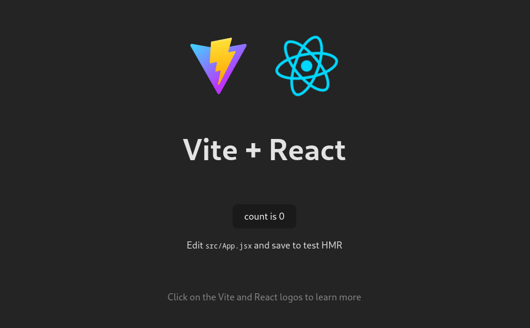

# Lesson 1 - Creating a React Application

In this lesson, we will introduce how to scaffold a React Single Page Application on your local machine. The created project will be using a build setup based on Vite.

Few reasons we chose Vite over `create-react-app` (CRA) because it is widely used in Laravel, so probably many of you are already familiar with Vite. As an application grows in size and complexity CRA performance tends to slow down.

> Prerequisites
> - Vite requires Node.js version 14.18+, 16+ or higher. Please upgrade if your package manager warns about it.
> - Familiarity with the command line

Run the following command in your command line to setup new React project.

```shell
npm init vite@latest
```

We have selected the following options.

```
✔ Project name: … React-Car-Parking-App-Demo
✔ Select a framework: › React
✔ Select a variant: › JavaScript

Scaffolding project in ./React-Car-Parking-App-Demo...

Done.
```

Once the project is created, follow the instructions to install dependencies and start the development server.

```shell
cd React-Car-Parking-App-Demo
npm install
npm run dev
```

When the server starts you will be prompted that the server is ready and the URL to access it will be show. Optionally you can hit `o` key to open url in the browser.

```

  VITE v4.1.1  ready in 329 ms

  ➜  Local:   http://localhost:5173/
  ➜  Network: use --host to expose
  ➜  press h to show help

```

In your browser you should see the default template.

