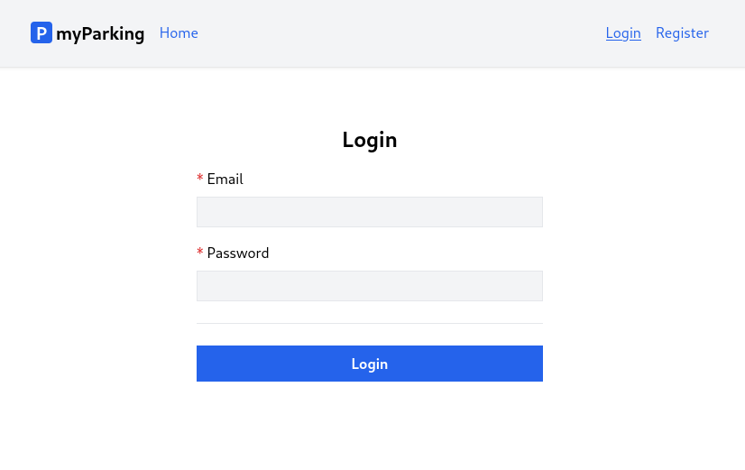
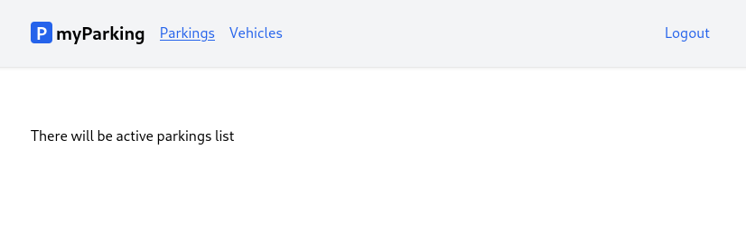

# Lesson 10 - Login page

Developing a login page has become a straightforward task, as we have already established all the necessary features for our application. It will closely resemble the registration page.



When a user logs in we want him to be redirected to the active parking list, so let's create a new empty component for this purpose, we will implement the active parking list later.



1. Create a new `src/views/parkings/ActiveParkings.jsx` component.

```jsx
function ActiveParkings() {
  return <div>There will be active parkings list</div>
}

export default ActiveParkings
```

2. Add a new named route `'parkings.active': '/parkings/active'` to the `src/routes/index.jsx` file.

```jsx
const routeNames = {
  'home': '/',
  'register': '/register',
  'login': '/login',
  'vehicles.index': '/vehicles',
  'parkings.active': '/parkings/active',
}
```

3. Define a new route for React Router in the `src/main.jsx` file.

```jsx
import ActiveParkings from '@/views/parkings/ActiveParkings'
```

```jsx
<Route path={ route('parkings.active') } element={<ActiveParkings />} />
```

The `src/main.jsx` file now should look like this.

```jsx
import React from 'react'
import ReactDOM from 'react-dom/client'
import { BrowserRouter, Routes, Route } from 'react-router-dom'
import axios from 'axios'
import App from '@/App'
import Home from '@/views/Home'
import Register from '@/views/auth/Register'
import Login from '@/views/auth/Login'
import VehiclesList from '@/views/vehicles/VehiclesList'
import ActiveParkings from '@/views/parkings/ActiveParkings'
import '@/assets/main.css'
import { route } from '@/routes'

window.axios = axios
window.axios.defaults.headers.common['X-Requested-With'] = 'XMLHttpRequest'
window.axios.defaults.withCredentials = true
window.axios.defaults.baseURL = 'http://parkingapi.test/api/v1'

ReactDOM.createRoot(document.getElementById('root')).render(
  <React.StrictMode>
    <BrowserRouter>
      <Routes>
        <Route path={ route('home') } element={<App />}>
          <Route index element={<Home />} />
          <Route path={ route('register') } element={<Register />} />
          <Route path={ route('login') } element={<Login />} />
          <Route path={ route('vehicles.index') } element={<VehiclesList />} />
          <Route path={ route('parkings.active') } element={<ActiveParkings />} />
        </Route>
      </Routes>
    </BrowserRouter>
  </React.StrictMode>,
)
```

4. Update the `leftAuthLinks` function in the `src/App.jsx` function by adding a navigation link to the `parkings.active` route for authenticated users before `vehicles.index`.

```jsx
function leftAuthLinks() {
  return <>
    <NamedLink name="parkings.active">
      Parkings
    </NamedLink>
    <NamedLink name="vehicles.index">
      Vehicles
    </NamedLink>
  </>
}
```

5. Extend the `src/hooks/useAuth.jsx` hook by adding a new function to send login requests.

```jsx
async function login(data) {
  setErrors({})
  setLoading(true)

  return axios.post('/auth/login', data)
    .then(response => {
      setAccessToken(response.data.access_token)
      navigate(route('parkings.active'))
    })
    .catch(error => {
      if (error.response.status === 422) {
        setErrors(error.response.data.errors)
      }
    })
    .finally(() => setLoading(false))
}
```

It is almost identical to the `register` function, and the structure was explained in previous lessons. Now it has a different `axios.post()` URL.

And add it to the return statement.

```jsx
return { register, login, errors, loading, isLoggedIn, logout }
```

The `src/hooks/useAuth.jsx` file now should have the following content.

```jsx
import { useState, useMemo, useEffect } from 'react'
import { useNavigate } from 'react-router-dom'
import { useLocalStorage } from 'react-use-storage'
import { route } from '@/routes'

export function useAuth() {
  const [errors, setErrors] = useState({})
  const [loading, setLoading] = useState(false)
  const [accessToken, setAccessToken, removeAccessToken] = useLocalStorage('access_token', '')

  const navigate = useNavigate()

  const isLoggedIn = useMemo(() => !!accessToken, [accessToken])

  useEffect(() => {
    if (accessToken) {
      axios.defaults.headers.common['Authorization'] = `Bearer ${accessToken}`
    }
  }, [accessToken])

  async function register(data) {
    setErrors({})
    setLoading(true)

    return axios.post('auth/register', data)
      .then((response) => {
        setAccessToken(response.data.access_token)
        navigate(route('vehicles.index'))
      })
      .catch(error => {
        if (error.response.status === 422) {
          setErrors(error.response.data.errors)
        }
      })
      .finally(() => setLoading(false))
  }

  async function login(data) {
    setErrors({})
    setLoading(true)

    return axios.post('/auth/login', data)
      .then(response => {
        setAccessToken(response.data.access_token)
        navigate(route('parkings.active'))
      })
      .catch(error => {
        if (error.response.status === 422) {
          setErrors(error.response.data.errors)
        }
      })
      .finally(() => setLoading(false))
  }

  async function logout(force = false) {
    if (!force) {
      await axios.post('auth/logout')
    }

    removeAccessToken()
    navigate(route('login'))
  }

  return { register, login, errors, loading, isLoggedIn, logout }
}
```

6. Update the `src/views/auth/Login.jsx` component with the following content.

```jsx
import { useState } from 'react'
import { useAuth } from '@/hooks/useAuth'
import ValidationError from '@/components/ValidationError'
import IconSpinner from '@/components/IconSpinner'

function Login() {
  const [email, setEmail] = useState('')
  const [password, setPassword] = useState('')
  const [remember, setRemember] = useState(false)
  const { login, errors, loading } = useAuth()

  async function handleSubmit(event) {
    event.preventDefault()

    await login({ email, password })

    setPassword('')
  }

  return (
    <form onSubmit={ handleSubmit } noValidate>
      <div className="flex flex-col mx-auto md:w-96 w-full">
        <h1 className="heading">Login</h1>
        <div className="flex flex-col gap-2 mb-4">
          <label htmlFor="email" className="required">Email</label>
          <input
            id="email"
            name="email"
            type="text"
            value={ email }
            onChange={ event => setEmail(event.target.value) }
            className="form-input"
            autoComplete="email"
            disabled={ loading }
          />
          <ValidationError errors={ errors } field="email" />
        </div>

        <div className="flex flex-col gap-2 mb-4">
          <label htmlFor="password" className="required">Password</label>
          <input
            id="password"
            name="password"
            type="password"
            value={ password }
            onChange={ event => setPassword(event.target.value) }
            className="form-input"
            autoComplete="current-password"
            disabled={ loading }
          />
          <ValidationError errors={ errors } field="password" />
        </div>

        <div className="flex flex-col gap-2">
          <label className="flex gap-2 items-center hover:cursor-pointer" htmlFor="remember">
            <input
              id="remember"
              name="remember"
              type="checkbox"
              className="w-4 h-4"
              checked={ remember }
              onChange={ () => setRemember((previous) => !previous) }
              disabled={ loading }
            />
            <span className="select-none">Remember me</span>
          </label>
        </div>

        <div className="border-t h-[1px] my-6"></div>

        <div className="flex flex-col gap-2 mb-4">
          <button type="submit" className="btn btn-primary" disabled={ loading }>
            { loading && <IconSpinner /> }
            Login
          </button>
        </div>
      </div>
    </form>
  )
}

export default Login
```

Here we have a new state variable for Remember me checkbox. It has a boolean value to determine checkbox is marked or not.

```jsx
const [remember, setRemember] = useState(false)
```

The checkbox itself is defined like this:

```jsx
<input
  id="remember"
  name="remember"
  type="checkbox"
  className="w-4 h-4"
  checked={ remember }
  onChange={ () => setRemember((previous) => !previous) }
  disabled={ loading }
/>
```

This time we bind the value to the `checked` attribute and the checkbox will be marked as checked if the `remember` variable evaluates to true.

When updating the state value using the `setRemember` function, it can accept the setter function with a `previous` value as an argument, then we just invert the boolean value using `!previous`.

```jsx
onChange={ () => setRemember((previous) => !previous) }
```

There is no need to redo any validation or loading state work, simply adjust the value of the `field` property in the `ValidationError` component to match the fields in the login form received from the API.
