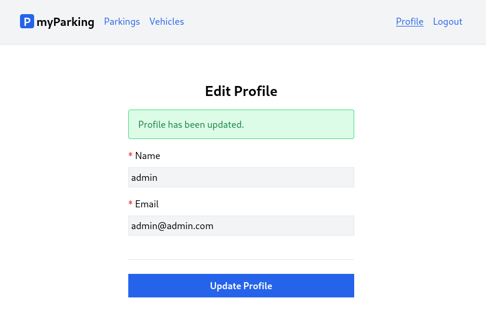

# Lesson 11 - Edit profile page

Let's keep building the client software by adding more functionality. In this lesson, we'll learn how to retrieve profile information and create a form for updating your profile details like your name and email.



1. First let's write our logic for a profile that we can later use in the profile view. Create a new `src/hooks/useProfile.jsx` hook with the following content.

```jsx
import { useState, useEffect } from 'react'

export function useProfile() {
  const [errors, setErrors] = useState({})
  const [loading, setLoading] = useState(false)
  const [status, setStatus] = useState('')
  const [data, setData] = useState({})

  useEffect(() => {
    const controller = new AbortController()
    getProfile({ signal: controller.signal })
    return () => controller.abort()
  }, [])

  async function getProfile({ signal } = {}) {
    setLoading(true)

    return axios.get('profile', { signal })
      .then(response => setData(response.data))
      .catch(() => {})
      .finally(() => setLoading(false))
  }

  async function updateProfile(data) {
    setLoading(true)
    setErrors({})
    setStatus('')

    return axios.put('profile', data)
      .then(() => {
        setStatus('Profile has been updated.')
      })
      .catch(error => {
        if (error.response.status === 422) {
          setErrors(error.response.data.errors)
        }
      })
      .finally(() => setLoading(false))
  }

  return [{ data, setData, errors, loading, status }, updateProfile]
}
```

It has a similar structure to `useAuth` with `errors` and `loading` states. To fetch user profile data we have the `getProfile` function.

```jsx
async function getProfile({ signal } = {}) {
  setLoading(true)

  return axios.get('profile', { signal })
    .then(response => setData(response.data))
    .catch(() => {})
    .finally(() => setLoading(false))
}
```

Response with profile data will be stored in the `data` state variable.

```jsx
useEffect(() => {
  const controller = new AbortController()
  getProfile({ signal: controller.signal })
  return () => controller.abort()
}, [])
```

To fetch data automatically on render `useEffect` comes in handy. But what is that abort controller?

The AbortController is a JavaScript API that allows you to signal to a fetch operation that you want to abort it. It provides a way to cancel a fetch operation before it completes, which can be useful in a variety of situations, such as when you're loading data from a remote server and the user navigates away from the page, or when a network request takes too long to complete.

An instance of AbortController is created using the `new AbortController()` constructor, and it exposes an `abort()` method that can be used to cancel the associated fetch operation. The AbortController also has a property `signal` which is an AbortSignal object that represents the signal to abort the operation.

Here's an example of how you might use the AbortController in a fetch operation:

```jsx
const controller = new AbortController();
const signal = controller.signal;

fetch('https://api.example.com/data', { signal })
  .then(response => {
    // Handle the response data
  })
  .catch(error => {
    if (error.name === 'AbortError') {
      // Handle the abort error
    } else {
      // Handle other errors
    }
  });

// Later, if you want to cancel the fetch operation:
controller.abort();
```

> Note that the AbortController API is relatively new and is not yet supported by all browsers, so you might need to use a polyfill or check for support before using it in your code.

So in our use case, the Axios library does accept that abort signal so we pass it to the `getProfile` function. It is useful when `useEffect` is triggered more than once, so previous requests will be aborted. That way we can avoid race conditions in this scenario:

```
1st request - takes 150ms
2nd request - takes 50ms
3rd request - takes 100ms
```

Without AbortController we can end up in a situation where we have data not from the latest request because 1st request finished last, and the data we got from 2nd and 3rd requests will be overwritten with the older one.

The `useEffect` hook returns a cleanup function that is called when the component that uses the hook is unmounted or when the effect is re-run with different dependencies. The cleanup function allows you to undo the changes made in the effect.

In our case we cancel the previous request like that:

```jsx
return () => controller.abort()
```

Note that this time we also have a bit different return statement:

```jsx
return [{ data, setData, errors, loading, status }, updateProfile]
```

This time we return an array instead of an object, this is useful when don't want to unpack every single value. And now it can be used like this:

```jsx
const [profile, updateProfile] = useProfile()
```

Profile data, errors, and loading state now can be accessed like this `profile.data`, `profile.errors`, etc. Very similar to `useState` in some way, except it wraps a lot more logic for our application.

One more new thing we have here is the state variable `status`:

```jsx
const [status, setStatus] = useState('')
```

It will be used to display a success message after successfully updating profile information by calling `setStatus` in the `updateProfile` function:

```jsx
setStatus('Profile has been updated.')
```

2. Create a new `src/views/profile/EditProfile.jsx` component with the following content.

```jsx
import { useProfile } from '@/hooks/useProfile'
import ValidationError from '@/components/ValidationError'
import IconSpinner from '@/components/IconSpinner'

function EditProfile() {
  const [profile, updateProfile] = useProfile()

  async function handleSubmit(event) {
    event.preventDefault()
    await updateProfile(profile.data)
  }

  return (
    <form onSubmit={ handleSubmit }>
      <div className="flex flex-col mx-auto md:w-96 w-full">
        <h1 className="heading">Edit Profile</h1>

        { profile.status &&
          <div className="alert alert-success mb-4" role="alert">
            { profile.status }
          </div>
        }

        <div className="flex flex-col gap-2 mb-4">
          <label htmlFor="name" className="required">Name</label>
          <input
            id="name"
            name="name"
            type="text"
            value={ profile.data.name ?? '' }
            onChange={ event => profile.setData({ ...profile.data, name: event.target.value }) }
            className="form-input"
            autoComplete="name"
            disabled={ profile.loading }
          />
          <ValidationError errors={ profile.errors } field="name" />
        </div>

        <div className="flex flex-col gap-2 mb-4">
          <label htmlFor="email" className="required">Email</label>
          <input
            id="email"
            name="email"
            type="email"
            value={ profile.data.email ?? '' }
            onChange={ event => profile.setData({ ...profile.data, email: event.target.value }) }
            className="form-input"
            autoComplete="email"
            disabled={ profile.loading }
          />
          <ValidationError errors={ profile.errors } field="email" />
        </div>

        <div className="border-t h-[1px] my-6"></div>

        <div className="flex flex-col gap-2 mb-4">
          <button type="submit" className="btn btn-primary" disabled={ profile.loading }>
            { profile.loading && <IconSpinner /> }
            Update Profile
          </button>
        </div>

      </div>
    </form>
  )
}

export default EditProfile
```

Now as mentioned before, we can consume the `useProfile` hook like this:

```jsx
const [profile, updateProfile] = useProfile()
```

Note that this time we have different `value` properties and `onChange` handlers on input fields.

While there is no data fetched yet, we can use the null coalescing operator to avoid `... is undefined` errors. This value will be updated automatically once the request is resolved.

```jsx
value={ profile.data.name ?? '' }
```

To update the profile we call the `profile.setData` function, and pass a new object unpacking all profile data using `...profile.data` and overwriting the key with the new value `name: event.target.value`. It is important to unpack first.

```jsx
onChange={ event => profile.setData({ ...profile.data, name: event.target.value }) }
```

A success message is displayed by using the same logic we used for `IconSpinner`, if the expression on the left evaluates to true then content after AND `&&` operator will be rendered, otherwise, it will render nothing.

```jsx
{ profile.status &&
  <div className="alert alert-success mb-4" role="alert">
    { profile.status }
  </div>
}
```

3. Update named routes in the `src/routes/index.jsx` file. The full content of this file now looks as follows.

```jsx
const routeNames = {
  'home': '/',
  'register': '/register',
  'login': '/login',
  'profile.edit': '/profile',
  'vehicles.index': '/vehicles',
  'parkings.active': '/parkings/active',
}

function route(name, params = {}) {
  let url = routeNames[name]

  for (let prop in params) {
    if (Object.prototype.hasOwnProperty.call(params, prop)) {
      url = url.replace(`:${prop}`, params[prop])
    }
  }

  return url
}

export { route }
```

4. Define the component with the `profile.edit` route in `src/main.jsx`. The full file should have the following content.

```jsx
import React from 'react'
import ReactDOM from 'react-dom/client'
import { BrowserRouter, Routes, Route } from 'react-router-dom'
import axios from 'axios'
import App from '@/App'
import Home from '@/views/Home'
import Register from '@/views/auth/Register'
import Login from '@/views/auth/Login'
import EditProfile from '@/views/profile/EditProfile'
import VehiclesList from '@/views/vehicles/VehiclesList'
import ActiveParkings from '@/views/parkings/ActiveParkings'
import '@/assets/main.css'
import { route } from '@/routes'

window.axios = axios
window.axios.defaults.headers.common['X-Requested-With'] = 'XMLHttpRequest'
window.axios.defaults.withCredentials = true
window.axios.defaults.baseURL = 'http://parkingapi.test/api/v1'

ReactDOM.createRoot(document.getElementById('root')).render(
  <React.StrictMode>
    <BrowserRouter>
      <Routes>
        <Route path={ route('home') } element={<App />}>
          <Route index element={<Home />} />
          <Route path={ route('register') } element={<Register />} />
          <Route path={ route('login') } element={<Login />} />
          <Route path={ route('profile.edit') } element={<EditProfile />} />
          <Route path={ route('vehicles.index') } element={<VehiclesList />} />
          <Route path={ route('parkings.active') } element={<ActiveParkings />} />
        </Route>
      </Routes>
    </BrowserRouter>
  </React.StrictMode>,
)
```

5. And finally add a link to the profile edit component in the `rightAuthLinks` function on the `src/App.jsx` file. The file should have the following content.

```jsx
import { Outlet } from 'react-router-dom'
import NamedLink from '@/components/NamedLink'
import { useAuth } from '@/hooks/useAuth'

function App() {
  const { isLoggedIn, logout } = useAuth()

  axios.interceptors.response.use(
    response => response,
    error => {
      if (error.response?.status === 401) logout(true)
      return Promise.reject(error)
    },
  )

  function leftGuestLinks() {
    return <>
      <NamedLink name="home">
        Home
      </NamedLink>
    </>
  }

  function leftAuthLinks() {
    return <>
      <NamedLink name="parkings.active">
        Parkings
      </NamedLink>
      <NamedLink name="vehicles.index">
        Vehicles
      </NamedLink>
    </>
  }

  function rightGuestLinks() {
    return <>
      <NamedLink name="login">
        Login
      </NamedLink>
      <NamedLink name="register">
        Register
      </NamedLink>
    </>
  }

  function rightAuthLinks() {
    return <>
      <NamedLink name="profile.edit">
        Profile
      </NamedLink>
      <button onClick={ logout } type="button" className="text-blue-600">
        Logout
      </button>
    </>
  }

  return (
    <div className="App">
      <header className="py-6 bg-gray-100 shadow">
        <div className="container md:px-2 px-4 mx-auto">
          <nav className="flex gap-4 justify-between">
            <div className="flex gap-4 items-center">
              <h2 className="text-xl font-bold">
                <div
                  className="inline-flex items-center justify-center bg-blue-600 w-6 h-6 text-center text-white rounded mr-1"
                >
                  P
                </div>
                myParking
              </h2>
              { isLoggedIn ? leftAuthLinks() : leftGuestLinks() }
            </div>
            <div className="flex gap-4 items-center">
              { isLoggedIn ? rightAuthLinks() : rightGuestLinks() }
            </div>
          </nav>
        </div>
      </header>
      <div className="container md:px-2 px-4 pt-8 md:pt-16 mx-auto">
        <Outlet />
      </div>
    </div>
  )
}

export default App
```
