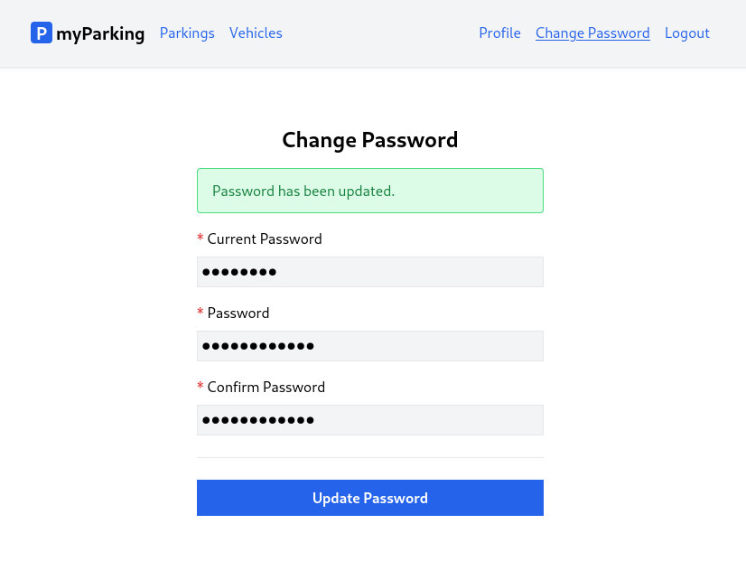

# Lesson 12 - Change password page

It's time to add the change password feature for our logged-in users. This lesson is even easier than the previous one since we won't need to retrieve anything from the server. Our change password form will have the following appearance.



Before we start implementing, let's first discuss why we can't have the password fields on the same profile page. While some websites or applications have this, it also brings up new issues:

-   The idea of leaving the password fields blank to keep the same password can be confusing for users.
-   It can be misinterpreted as there being no password.
-   Displaying the fields as required can add to the confusion.
-   It can be unclear how to mark the fields when they are all required if any of them is filled.
-   If all fields are required, why do you need to change the password just to update the name?
-   Validating the submitted form on the backend becomes more complex and now has to handle both account details and password changes which we think are separate concerns.

Having a separate form specifically for changing passwords solves all of these problems and benefits both users and developers. With that in mind, let's implement the form.

1. Create a new `src/hooks/usePassword.jsx` hook.

```jsx
import { useState } from 'react'

export function usePassword() {
  const [errors, setErrors] = useState({})
  const [loading, setLoading] = useState(false)
  const [status, setStatus] = useState('')

  async function updatePassword(data) {
    setLoading(true)
    setErrors({})
    setStatus('')

    return axios.put('password', data)
      .then(() => setStatus('Password has been updated.'))
      .catch(error => {
        if (error.response.status === 422) {
          setErrors(error.response.data.errors)
        }
      })
      .finally(() => setLoading(false))
  }

  return { errors, loading, status, updatePassword }
}
```

2. Create a new `src/views/profile/ChangePassword.jsx` component.

```jsx
import { useState } from 'react'
import { usePassword } from '@/hooks/usePassword'
import ValidationError from '@/components/ValidationError'
import IconSpinner from '@/components/IconSpinner'

function ChangePassword() {
  const [currentPassword, setCurrentPassword] = useState('')
  const [password, setPassword] = useState('')
  const [passwordConfirmation, setPasswordConfirmation] = useState('')
  const { errors, loading, status, updatePassword } = usePassword()

  async function handleSubmit(event) {
    event.preventDefault()

    await updatePassword({
      current_password: currentPassword,
      password,
      password_confirmation: passwordConfirmation,
    })

    setCurrentPassword('')
    setPassword('')
    setPasswordConfirmation('')
  }

  return (
    <form onSubmit={ handleSubmit } noValidate>
      <div className="flex flex-col mx-auto md:w-96 w-full">

        <h1 className="heading">Change Password</h1>

        { status &&
          <div className="alert alert-success mb-4" role="alert">
            { status }
          </div>
        }

        <div className="flex flex-col gap-2 mb-4">
          <label htmlFor="current_password" className="required">Current Password</label>
          <input
            id="current_password"
            name="current_password"
            type="password"
            value={ currentPassword }
            onChange={ event => setCurrentPassword(event.target.value) }
            className="form-input"
            autoComplete="current-password"
            disabled={ loading }
          />
          <ValidationError errors={ errors } field="current_password" />
        </div>

        <div className="flex flex-col gap-2 mb-4">
          <label htmlFor="password" className="required">Password</label>
          <input
            id="password"
            name="password"
            type="password"
            value={ password }
            onChange={ event => setPassword(event.target.value) }
            className="form-input"
            autoComplete="new-password"
            disabled={ loading }
          />
          <ValidationError errors={ errors } field="password" />
        </div>

        <div className="flex flex-col gap-2">
          <label htmlFor="password_confirmation" className="required">Confirm Password</label>
          <input
            id="password_confirmation"
            name="password_confirmation"
            type="password"
            value={ passwordConfirmation }
            onChange={ event => setPasswordConfirmation(event.target.value) }
            className="form-input"
            autoComplete="new-password"
            disabled={ loading }
          />
        </div>

        <div className="border-t h-[1px] my-6"></div>

        <div className="flex flex-col gap-2 mb-4">
          <button type="submit" className="btn btn-primary" disabled={ loading }>
            { loading && <IconSpinner /> }
            Update Password
          </button>
        </div>
      </div>
    </form>
  )
}

export default ChangePassword
```

3. Add new `profile.change-password` named route to `src/routes/index.jsx` file.

```jsx
const routeNames = {
  'home': '/',
  'register': '/register',
  'login': '/login',
  'profile.edit': '/profile',
  'profile.change-password': '/profile/change-password',
  'vehicles.index': '/vehicles',
  'parkings.active': '/parkings/active',
}
```

4. Import `ChangePassword` component and bind route in `src/main.jsx` file.

```jsx
import ChangePassword from '@/views/profile/ChangePassword'
```

```jsx
<Route path={ route('profile.change-password') } element={<ChangePassword />} />
```

5. And finally add a link to change password view in `rightAuthLinks` function on `src/App.jsx` file.

```jsx
function rightAuthLinks() {
  return <>
    <NamedLink name="profile.edit">
      Profile
    </NamedLink>
    <NamedLink name="profile.change-password">
      Change Password
    </NamedLink>
    <button onClick={ logout } type="button" className="text-blue-600">
      Logout
    </button>
  </>
}
```
