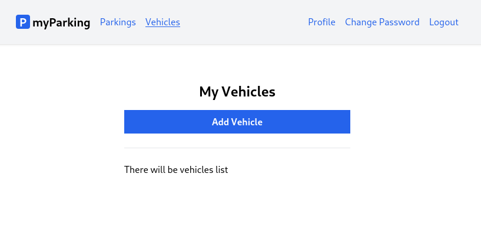
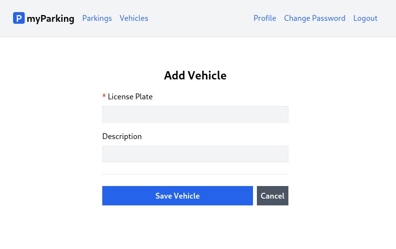

# Lesson 13 - Create a vehicle

In order to be able to book parking in a specific zone, the user must first add their own vehicles. This lesson will focus on implementing the first CRUD operation.



And the form to add a vehicle will look like this. After pressing the `Save Vehicle` button form is submitted to the server and then redirected back to the list. Pressing the `Cancel` button redirect will discard the form data without submitting it and will redirect back to the list.



1. Create a new `src/hooks/useVehicle.jsx` hook.

```jsx
import { useState } from 'react'
import { useNavigate } from 'react-router-dom'
import { route } from '@/routes'

export function useVehicle() {
  const [errors, setErrors] = useState({})
  const [loading, setLoading] = useState(false)
  const [data, setData] = useState({})
  const navigate = useNavigate()

  function createVehicle(data) {
    setLoading(true)
    setErrors({})

    return axios.post('vehicles', data)
      .then(() => navigate(route('vehicles.index')))
      .catch(error => {
        if (error.response.status === 422) {
          setErrors(error.response.data.errors)
        }
      })
      .finally(() => setLoading(false))
  }

  return {
    vehicle: { data, setData, errors, loading },
    createVehicle,
  }
}
```

2. Create a new `src/views/vehicles/CreateVehicle.jsx` component.

```jsx
import { useNavigate } from 'react-router-dom'
import { useVehicle } from '@/hooks/useVehicle'
import { route } from '@/routes'
import ValidationError from '@/components/ValidationError'
import IconSpinner from '@/components/IconSpinner'

function CreateVehicle() {
  const { vehicle, createVehicle } = useVehicle()
  const navigate = useNavigate()

  async function handleSubmit(event) {
    event.preventDefault()

    await createVehicle(vehicle.data)
  }

  return (
    <form onSubmit={ handleSubmit } noValidate>
      <div className="flex flex-col mx-auto md:w-96 w-full">

        <h1 className="heading">Add Vehicle</h1>

        <div className="flex flex-col gap-2 mb-4">
          <label htmlFor="plate_number" className="required">License Plate</label>
          <input
            id="plate_number"
            name="plate_number"
            type="text"
            value={ vehicle.data.plate_number ?? '' }
            onChange={ event => vehicle.setData({
              ...vehicle.data,
              plate_number: event.target.value,
            }) }
            className="form-input plate"
            disabled={ vehicle.loading }
          />
          <ValidationError errors={ vehicle.errors } field="plate_number" />
        </div>

        <div className="flex flex-col gap-2">
          <label htmlFor="description">Description</label>
          <input
            id="description"
            name="description"
            type="text"
            value={ vehicle.data.description ?? '' }
            onChange={ event => vehicle.setData({
              ...vehicle.data,
              description: event.target.value,
            }) }
            className="form-input"
            disabled={ vehicle.loading }
          />
          <ValidationError errors={ vehicle.errors } field="email" />
        </div>

        <div className="border-t h-[1px] my-6"></div>

        <div className="flex items-center gap-2">
          <button
            type="submit"
            className="btn btn-primary w-full"
            disabled={ vehicle.loading }
          >
            { vehicle.loading && <IconSpinner /> }
            Save Vehicle
          </button>

          <button
            type="button"
            className="btn btn-secondary"
            disabled={ vehicle.loading }
            onClick={ () => navigate(route('vehicles.index')) }
          >
            <span>Cancel</span>
          </button>
        </div>
      </div>
    </form>
  )
}

export default CreateVehicle
```

For the cancel action, we created a regular button with the `type="button"` attribute, and added an `onClick` handler with an anonymous function to navigate to the `vehicles.index` named route.

```jsx
<button
  type="button"
  className="btn btn-secondary"
  disabled={ vehicle.loading }
  onClick={ () => navigate(route('vehicles.index')) }
>
  <span>Cancel</span>
</button>
```

We didn't use `Link` or `NavLink` for this purpose because they don't support the `disabled` property and we want to prevent cancel action while the form is being processed.

3. Add a new named route `'vehicles.create': '/vehicles/create',` in the `src/routes/index.jsx` file.

```jsx
const routeNames = {
  'home': '/',
  'register': '/register',
  'login': '/login',
  'profile.edit': '/profile',
  'profile.change-password': '/profile/change-password',
  'vehicles.index': '/vehicles',
  'vehicles.create': '/vehicles/create',
  'parkings.active': '/parkings/active',
}
```

4. Update `src/main.jsx` by importing the newly created component.

```jsx
import CreateVehicle from '@/views/vehicles/CreateVehicle'
```

and defining a route for it

```jsx
<Route path={ route('vehicles.create') } element={<CreateVehicle />} />
```

5. Finally update `src/views/vehicles/VehiclesList.jsx` with the following content to have a link to the `vehicles.create` form.

```jsx
import { Link } from 'react-router-dom'
import { route } from '@/routes'

function VehiclesList() {
  return (
    <div className="flex flex-col mx-auto md:w-96 w-full">

      <h1 className="heading">My Vehicles</h1>

      <Link to={ route('vehicles.create') } className="btn btn-primary">
        Add Vehicle
      </Link>

      <div className="border-t h-[1px] my-6"></div>

      <div>There will be vehicles list</div>
    </div>
  )
}

export default VehiclesList
```

Let's move forward to the next lesson and display the vehicles list on the client.