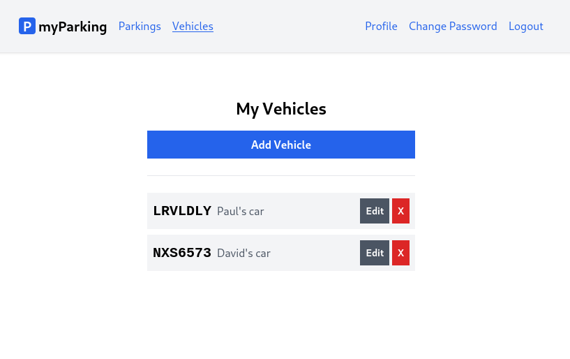

# Lesson 14 - Vehicles list

Our objective for this lesson should be to display a list of the user's vehicles after a new vehicle has been added to their account.



1. Create new `src/hooks/useVehicles.jsx` hook.

It will fetch vehicle data automatically using `useEffect` as we did with the profile.

```jsx
import { useState, useEffect } from 'react'

export function useVehicles() {
  const [vehicles, setVehicles] = useState([])

  useEffect(() => {
    const controller = new AbortController()
    getVehicles({ signal: controller.signal })
    return () => { controller.abort() }
  }, [])

  async function getVehicles({ signal } = {}) {
    return axios.get('vehicles', { signal })
      .then(response => setVehicles(response.data.data))
      .catch(() => {})
  }

  return { vehicles }
}
```

All we need to do now is just grab the `vehicles` array and display data returned from API.

2. Update the `src/views/vehicles/VehiclesList.jsx` component with the following content.

```jsx
import { Link } from 'react-router-dom'
import { route } from '@/routes'
import { useVehicles } from '@/hooks/useVehicles'

function VehiclesList() {
  const { vehicles } = useVehicles()

  return (
    <div className="flex flex-col mx-auto md:w-96 w-full">

      <h1 className="heading">My Vehicles</h1>

      <Link to={ route('vehicles.create') } className="btn btn-primary">
        Add Vehicle
      </Link>

      <div className="border-t h-[1px] my-6"></div>

      <div className="flex flex-col gap-2">
        { vehicles.length > 0 && vehicles.map(vehicle => {
          return (
            <div
              key={ vehicle.id }
              className="flex bg-gray-100 w-full p-2 justify-between"
            >
              <div className="flex items-center overflow-hidden w-full">
                <div className="text-xl plate">
                  { vehicle.plate_number }
                </div>
                <div className="font-normal text-gray-600 pl-2 grow truncate">
                  { vehicle.description }
                </div>
              </div>
              <div className="flex gap-1">
                <button type="button" className="btn btn-secondary text-sm">
                  Edit
                </button>
                <button type="button" className="btn text-white bg-red-600 hover:bg-red-500 text-sm">
                  X
                </button>
              </div>
            </div>
          )
        })}
      </div>
    </div>
  )
}

export default VehiclesList
```

We will often need to display multiple similar components from a collection of data. We can use the JavaScript array methods to manipulate an array of data. This can be easily achieved using the following structure.

```jsx
{ data.length > 0 && data.map(o => <div>{ o }</div>) }
```

In our case, we iterate over vehicles and map them to a new array of JSX nodes which will be rendered.

```jsx
{ vehicles.length > 0 && vehicles.map(vehicle => {
  return (
    <div key={ vehicle.id } >
      {/* ... */}
    </div>
  )
})}
```

To keep items in order we need to give each array item a `key` - a string or a number that uniquely identifies it among other items in that array:

```jsx
<div key={ vehicle.id } >
```

> JSX elements directly inside a `map()` call always need keys.

Keys tell React which array item each component corresponds to so that it can match them up later. This becomes important if your array items can move (e.g. due to sorting), get inserted, or get deleted. Keys must be unique.

The vehicle id is perfectly suitable for that.

To display the value of an object we can use this syntax.

```jsx
{ vehicle.plate_number }
```

It will be replaced with the value of the `vehicle.plate_number` property from the vehicle object.

Each list item also contains Edit and Remove buttons which we're going to implement next lessons.
