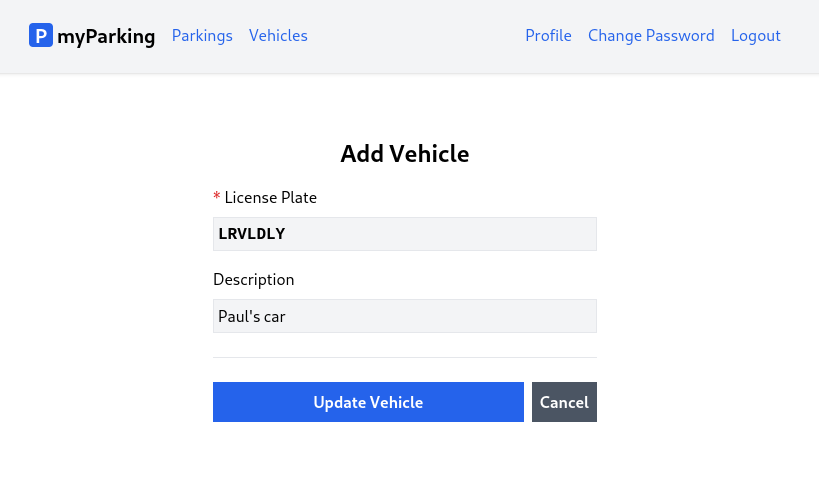

# Lesson 15 - Edit vehicle

In this lesson, we will incorporate an edit form into the vehicle's CRUD operation. This form will be similar to the create form, except it will have a different URL `/vehicles/:id/edit`. The data of a specific vehicle will be retrieved from the API using the `:id` URL parameter.



1. Update the `src/hooks/useVehicle.jsx` hook with the following content.

```jsx
import { useState, useEffect } from 'react'
import { useNavigate } from 'react-router-dom'
import { route } from '@/routes'

export function useVehicle(id = null) {
  const [errors, setErrors] = useState({})
  const [loading, setLoading] = useState(false)
  const [data, setData] = useState({})
  const navigate = useNavigate()

  useEffect(() => {
    if (id !== null) {
      const controller = new AbortController()
      getVehicle(id, { signal: controller.signal })
      return () => controller.abort()
    }
  }, [id])

  async function createVehicle(vehicle) {
    setLoading(true)
    setErrors({})

    return axios.post('vehicles', vehicle)
      .then(() => navigate(route('vehicles.index')))
      .catch(error => {
        if (error.response.status === 422) {
          setErrors(error.response.data.errors)
        }
      })
      .finally(() => setLoading(false))
  }

  async function getVehicle(id, { signal } = {}) {
    setLoading(true)

    return axios.get(`vehicles/${id}`, { signal })
      .then(response => setData(response.data.data))
      .catch(() => {})
      .finally(() => setLoading(false))
  }

  async function updateVehicle(vehicle) {
    setLoading(true)
    setErrors({})

    return axios.put(`vehicles/${vehicle.id}`, vehicle)
      .then(() => navigate(route('vehicles.index')))
      .catch(error => {
        if (error.response.status === 422) {
          setErrors(error.response.data.errors)
        }
      })
      .finally(() => setLoading(false))
  }

  return {
    vehicle: { data, setData, errors, loading },
    createVehicle,
    updateVehicle,
  }
}
```

In the `src/hooks/useVehicle.jsx` hook, we have two additional methods:

-   `updateVehicle` - This will be invoked when the form is submitted, and like the `createVehicle` function, it will redirect us to the `VehiclesList` if the request is successful. It takes a `vehicle` object as a parameter.
-   `getVehicle` - This retrieves data for a specific vehicle and updates the form fields to be edited. It takes the `id` of the vehicle as a parameter and, if needed, a signal from an AbortController.


The `useVehicle` hook now takes an optional parameter `id` with a default value of `null`.

```jsx
export function useVehicle(id = null) {
```

If the `id` parameter is supplied, the `useEffect` hook will automatically fetch vehicle data using the `getVehicle` function and update the `data` state when the component is mounted.

```jsx
useEffect(() => {
  if (id !== null) {
    const controller = new AbortController()
    getVehicle(id, { signal: controller.signal })
    return () => controller.abort()
  }
}, [id])
```

Note that we have defined `[id]` on `useEffect`'s dependencies. In case you decide to change the id parameter programmatically vehicle data will be re-fetched.

And to return the statement was added `updateVehicle` function.

```jsx
return {
  vehicle: { data, setData, errors, loading },
  createVehicle,
  updateVehicle,
}
```

2. Create a new `src/views/vehicles/EditVehicle.jsx` component with the following content.

```jsx
import { useNavigate, useParams } from 'react-router-dom'
import { useVehicle } from '@/hooks/useVehicle'
import { route } from '@/routes'
import ValidationError from '@/components/ValidationError'
import IconSpinner from '@/components/IconSpinner'

function EditVehicle() {
  const params = useParams()
  const { vehicle, updateVehicle } = useVehicle(params.id)
  const navigate = useNavigate()

  async function handleSubmit(event) {
    event.preventDefault()

    await updateVehicle(vehicle.data)
  }

  return (
    <form onSubmit={ handleSubmit } noValidate>
      <div className="flex flex-col mx-auto md:w-96 w-full">

        <h1 className="heading">Add Vehicle</h1>

        <div className="flex flex-col gap-2 mb-4">
          <label htmlFor="plate_number" className="required">License Plate</label>
          <input
            id="plate_number"
            name="plate_number"
            type="text"
            value={ vehicle.data.plate_number ?? '' }
            onChange={ event => vehicle.setData({
              ...vehicle.data,
              plate_number: event.target.value,
            }) }
            className="form-input plate"
            disabled={ vehicle.loading }
          />
          <ValidationError errors={ vehicle.errors } field="plate_number" />
        </div>

        <div className="flex flex-col gap-2">
          <label htmlFor="description">Description</label>
          <input
            id="description"
            name="description"
            type="text"
            value={ vehicle.data.description ?? '' }
            onChange={ event => vehicle.setData({
              ...vehicle.data,
              description: event.target.value,
            }) }
            className="form-input"
            disabled={ vehicle.loading }
          />
          <ValidationError errors={ vehicle.errors } field="email" />
        </div>

        <div className="border-t h-[1px] my-6"></div>

        <div className="flex items-center gap-2">
          <button
            type="submit"
            className="btn btn-primary w-full"
            disabled={ vehicle.loading }
          >
            { vehicle.loading && <IconSpinner /> }
            Update Vehicle
          </button>

          <button
            type="button"
            className="btn btn-secondary"
            disabled={ vehicle.loading }
            onClick={ () => navigate(route('vehicles.index')) }
          >
            <span>Cancel</span>
          </button>
        </div>
      </div>
    </form>
  )
}

export default EditVehicle
```

3. Define the named route `vehicles.edit` in the `src/routes/index.jsx` file.

```jsx
const routeNames = {
  'home': '/',
  'register': '/register',
  'login': '/login',
  'profile.edit': '/profile',
  'profile.change-password': '/profile/change-password',
  'vehicles.index': '/vehicles',
  'vehicles.create': '/vehicles/create',
  'vehicles.edit': '/vehicles/:id/edit',
  'parkings.active': '/parkings/active',
}
```

4. Import the `EditVehicle` component and declare the route for that component in the `src/main.jsx` file.

```jsx
import EditVehicle from '@/views/vehicles/EditVehicle'
```

```jsx
<Route path={ route('vehicles.edit') } element={<EditVehicle />} />
```

The full content looks like this:

```jsx
import React from 'react'
import ReactDOM from 'react-dom/client'
import { BrowserRouter, Routes, Route } from 'react-router-dom'
import axios from 'axios'
import App from '@/App'
import Home from '@/views/Home'
import Register from '@/views/auth/Register'
import Login from '@/views/auth/Login'
import EditProfile from '@/views/profile/EditProfile'
import ChangePassword from '@/views/profile/ChangePassword'
import VehiclesList from '@/views/vehicles/VehiclesList'
import CreateVehicle from '@/views/vehicles/CreateVehicle'
import EditVehicle from '@/views/vehicles/EditVehicle'
import ActiveParkings from '@/views/parkings/ActiveParkings'
import '@/assets/main.css'
import { route } from '@/routes'

window.axios = axios
window.axios.defaults.headers.common['X-Requested-With'] = 'XMLHttpRequest'
window.axios.defaults.withCredentials = true
window.axios.defaults.baseURL = 'http://parkingapi.test/api/v1'

ReactDOM.createRoot(document.getElementById('root')).render(
  <React.StrictMode>
    <BrowserRouter>
      <Routes>
        <Route path={ route('home') } element={<App />}>
          <Route index element={<Home />} />
          <Route path={ route('register') } element={<Register />} />
          <Route path={ route('login') } element={<Login />} />
          <Route path={ route('profile.edit') } element={<EditProfile />} />
          <Route path={ route('profile.change-password') } element={<ChangePassword />} />
          <Route path={ route('vehicles.index') } element={<VehiclesList />} />
          <Route path={ route('vehicles.create') } element={<CreateVehicle />} />
          <Route path={ route('vehicles.edit') } element={<EditVehicle />} />
          <Route path={ route('parkings.active') } element={<ActiveParkings />} />
        </Route>
      </Routes>
    </BrowserRouter>
  </React.StrictMode>,
)
```

The line `<Route path={ route('vehicles.edit') } element={<EditVehicle />} />` will be evaluated to this:

```jsx
<Route path="/vehicles/:id/edit" element={<EditVehicle />} />
```

Now let's go through new things.

### Dynamic Routing

Very often we will need to map routes with the given pattern to the same component. We have the `src/views/vehicles/EditVehicle.jsx` component which should be rendered for all vehicles but with different vehicle IDs. In React Router we can use a dynamic segment in the path to achieving this. We call that a param.

Now URLs like `/vehicles/1/edit` and `/vehicles/3/edit` will both map to the same route.

A param is denoted by a colon `:`. When a route is matched, the value of its params will be exposed as `params.id` in the `VehicleEdit` component.

To access route parameters we need to import the `useParams` hook.

```jsx
import { useNavigate, useParams } from 'react-router-dom'
```

```jsx
const params = useParams()
const { vehicle, updateVehicle } = useVehicle(params.id)
```

And we pass that value to the `useVehicle` hook.

5. To get the edit button working when we press it in the `src/views/vehicles/VehiclesList.jsx` component replace this part:

From

```jsx
<button type="button" className="btn btn-secondary text-sm">
  Edit
</button>
```

To

```jsx
<Link
  to={ route('vehicles.edit', { id: vehicle.id }) }
  className="btn btn-secondary text-sm"
>
  Edit
</Link>
```

It is important to note that when calling the `route` function, we pass an additional parameter `id` along with `vehicle.id`. This replaces the `:id` portion in our path with the actual id of the vehicle that we want to edit.

The full contents of this file look like this.

```jsx
import { Link } from 'react-router-dom'
import { route } from '@/routes'
import { useVehicles } from '@/hooks/useVehicles'

function VehiclesList() {
  const { vehicles } = useVehicles()

  return (
    <div className="flex flex-col mx-auto md:w-96 w-full">

      <h1 className="heading">My Vehicles</h1>

      <Link to={ route('vehicles.create') } className="btn btn-primary">
        Add Vehicle
      </Link>

      <div className="border-t h-[1px] my-6"></div>

      <div className="flex flex-col gap-2">
        { vehicles.length > 0 && vehicles.map(vehicle => {
          return (
            <div
              key={ vehicle.id }
              className="flex bg-gray-100 w-full p-2 justify-between"
            >
              <div className="flex items-center overflow-hidden w-full">
                <div className="text-xl plate">
                  { vehicle.plate_number }
                </div>
                <div className="font-normal text-gray-600 pl-2 grow truncate">
                  { vehicle.description }
                </div>
              </div>
              <div className="flex gap-1">
                <Link
                  to={ route('vehicles.edit', { id: vehicle.id }) }
                  className="btn btn-secondary text-sm"
                >
                  Edit
                </Link>
                <button type="button" className="btn text-white bg-red-600 hover:bg-red-500 text-sm">
                  X
                </button>
              </div>
            </div>
          )
        })}
      </div>
    </div>
  )
}

export default VehiclesList
```

Now let's move to the next lesson and implement the delete button.