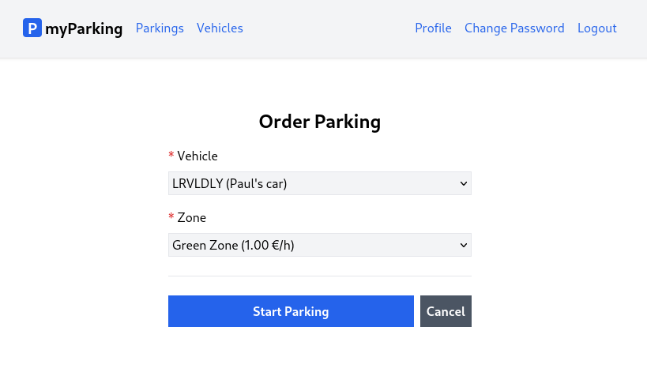

# Lesson 17 - Order new parking page

Time to create a form to allow users to start parking by choosing one of the vehicles they added to their account and selecting the zone.



1. To start parking create a new `src/hooks/useParking.jsx` hook with the `startParking` function which will submit vehicle and zone ids to API.

```jsx
import { useState } from 'react'
import { useNavigate } from 'react-router-dom'
import { route } from '@/routes'

export function useParking() {
  const navigate = useNavigate()
  const [errors, setErrors] = useState({})
  const [loading, setLoading] = useState(false)

  async function startParking(data) {
    return axios.post('parkings/start', data)
      .then(() => navigate(route('parkings.active')))
      .catch(error => {
        if (error.response.status === 422) {
          setErrors(error.response.data.errors)
        }
      })
      .finally(() => setLoading(false))
  }

  return { loading, errors, startParking }
}
```

2. Create a new `src/hooks/useZones.jsx` hook with the `getZones` function. This will provide us with data about available parking zones to choose from.

```jsx
import { useState, useEffect } from 'react'

export function useZones() {
  const [zones, setZones] = useState([])

  useEffect(() => {
    const controller = new AbortController()
    getZones({ signal: controller.signal })
    return () => { controller.abort() }
  }, [])

  async function getZones({ signal } = {}) {
    return axios.get('zones', { signal })
      .then(response => setZones(response.data.data))
      .catch(() => {})
  }

  return { zones }
}
```

3. This is where it gets more interesting. Create a new `src/views/parkings/OrderParking.jsx` component.

```jsx
import { useState, useEffect } from 'react'
import { useNavigate } from 'react-router-dom'
import { route } from '@/routes'
import ValidationError from '@/components/ValidationError'
import IconSpinner from '@/components/IconSpinner'
import { useVehicles } from '@/hooks/useVehicles'
import { useZones } from '@/hooks/useZones'
import { useParking } from '@/hooks/useParking'

function OrderParking() {
  const navigate = useNavigate()
  const { errors, loading, startParking } = useParking()
  const { zones } = useZones()
  const { vehicles } = useVehicles()
  const [vehicle_id, setVehicleId] = useState()
  const [zone_id, setZoneId] = useState()

  useEffect(() => setVehicleId(vehicles[0]?.id), [vehicles])
  useEffect(() => setZoneId(zones[0]?.id), [zones])

  async function handleSubmit(event) {
    event.preventDefault()

    await startParking({ vehicle_id, zone_id })
  }

  return (
    <form onSubmit={ handleSubmit } noValidate>
      <div className="flex flex-col mx-auto md:w-96 w-full">

        <h1 className="heading">Order Parking</h1>

        <div className="flex flex-col gap-2 mb-4">
          <label htmlFor="vehicle_id" className="required">Vehicle</label>
          <select
            id="vehicle_id"
            className="form-input"
            value={ vehicle_id }
            onChange={ (event) => setVehicleId(event.target.value) }
            disabled={ loading }
          >
            { vehicles.length > 0 && vehicles.map((vehicle) => {
              return <option key={ vehicle.id } value={ vehicle.id }>
                { vehicle.plate_number.toUpperCase() }{' '}
                { vehicle.description && '('+vehicle.description+')' }
              </option>
            }) }
          </select>
          <ValidationError errors={ errors } field="vehicle_id" />
        </div>

        <div className="flex flex-col gap-2">
          <label htmlFor="zone_id" className="required">Zone</label>
          <select
            name="zone_id"
            id="zone_id"
            value={ zone_id }
            className="form-input"
            onChange={ (event) => setZoneId(event.target.value) }
            disabled={ loading }
          >
            { zones.length > 0 && zones.map((zone) => {
              return <option key={ zone.id } value={ zone.id }>
                { zone.name }{' '}
                ({ (zone.price_per_hour / 100).toFixed(2) } &euro;/h)
              </option>
            }) }
          </select>
          <ValidationError errors={ errors } field="zone_id" />
          <ValidationError errors={ errors } field="general" />
        </div>

        <div className="border-t h-[1px] my-6"></div>

        <div className="flex items-center gap-2">
          <button
            type="submit"
            className="btn btn-primary w-full"
            disabled={ loading }
          >
            { loading && <IconSpinner /> }
            Start Parking
          </button>

          <button
            type="button"
            className="btn btn-secondary"
            disabled={ loading }
            onClick={ () => navigate(route('parkings.active')) }
          >
            <span>Cancel</span>
          </button>
        </div>
      </div>
    </form>
  )
}

export default OrderParking
```

We have all three hooks imported.

```jsx
const { errors, loading, startParking } = useParking()
const { zones } = useZones()
const { vehicles } = useVehicles()
```

`useParking` - provides us with `errors`, `loading` state, and `startParking` functions.
`useZones` - gives us an array of `zones`, it fetches them automatically.
`useVehicles` - provides us with an array of `vehicles`. We have created this in previous lessons. The whole reason to separate business logic into hooks is that we can later reuse it without the need to implement it once again.

`vehicle_id` and `zone_id` will be used to store we chose from `<select>` dropdown.

```jsx
const [vehicle_id, setVehicleId] = useState()
const [zone_id, setZoneId] = useState()
```

The `<select>` dropdown has the following structure:

```jsx
<select
  value={ vehicle_id }
  onChange={ (event) => setVehicleId(event.target.value) }
  disabled={ loading }
>
  { vehicles.length > 0 && vehicles.map((vehicle) => {
    return <option key={ vehicle.id } value={ vehicle.id }>
      { vehicle.plate_number.toUpperCase() }{' '}
      { vehicle.description && '('+vehicle.description+')' }
    </option>
  }) }
</select>
```

It has the same `value` property as the `<input>` field to represent the current state of `vehicle_id`. `onChange` handler will update the corresponding state variable when we choose the particular `<option>`.

To display all options with vehicles available we iterate them using `vehicles.length > 0 && vehicles.map()` as we did in the vehicles index view. When using the array method `map` we always need to define the `key` property with a unique value to let JSX keep track of nodes.

When we load the form none of our options will be selected by default and the default attribute `selected` doesn't work there.

Initially `vehicle_id` and `zone_id` have an undefined value, but we do not know what ids are available, so in order to do that we need to update `vehicle_id` and `zone_id` after we fetch the lists of `vehicles` and `zones`. This is done by using the `useEffect` hook, `vehicles` are added to the dependencies list, so when the value changes it calls `setVehicleId` with the id from the first element. The same applies to `zones`.

```jsx
useEffect(() => setVehicleId(vehicles[0]?.id), [vehicles])
useEffect(() => setZoneId(zones[0]?.id), [zones])
```

On the bottom of the form we have an additional `ValidationError` component with a field named `general`.

```jsx
<ValidationError errors={ errors } field="general" />
```

`general` errors are displayed when API returns errors not related to fields. For example, if you try to start parking while having one active on your vehicle.

Finally, we submit the form by calling `startParking` and providing an object with `vehicle_id` and `zone_id` as a parameter.

```jsx
async function handleSubmit(event) {
  event.preventDefault()

  await startParking({ vehicle_id, zone_id })
}
```

It is important to note that the `<option>` element is pretty limited to styling, this is a reason we didn't apply any CSS classes.

```jsx
return <option key={ vehicle.id } value={ vehicle.id }>
  { vehicle.plate_number.toUpperCase() }{' '}
  { vehicle.description && '('+vehicle.description+')' }
</option>
```

Similarly, we format zone options.

To display plate numbers in uppercase we can use JavaScript's string method `toUpperCase()`. For description, if `vehicle.description` enumerates to true, we display that description.

```jsx
return <option key={ zone.id } value={ zone.id }>
  { zone.name }{' '}
  ({ (zone.price_per_hour / 100).toFixed(2) } &euro;/h)
</option>
```

`zone.price_per_hour` is returned in cents from the API. By dividing it by 100 it would give us a result of `1`. To always display decimal points we need to use the `toFixed()` function which is native JavaScript's method for integers and floats. How many decimal points to display is specified by a parameter, in our case, it is `toFixed(2)`. For the euro currency sign in HTML, there is a `&euro;` code.

4. Add the `parkings.create` route to the `src/routes/index.jsx` file.

```jsx
const routeNames = {
  'home': '/',
  'register': '/register',
  'login': '/login',
  'profile.edit': '/profile',
  'profile.change-password': '/profile/change-password',
  'vehicles.index': '/vehicles',
  'vehicles.create': '/vehicles/create',
  'vehicles.edit': '/vehicles/:id/edit',
  'parkings.active': '/parkings/active',
  'parkings.create': '/parkings/new',
}
```

5. Import the `OrderParking` component and define the route in the `src/main.jsx` file.

```jsx
import OrderParking from '@/views/parkings/OrderParking'
```

```jsx
<Route path={ route('parkings.create') } element={<OrderParking />} />
```

6. And finally update the `src/views/parkings/ActiveParkings.jsx` component with the following content.

```jsx
import { Link } from 'react-router-dom'
import { route } from '@/routes'

function ActiveParkings() {
  return (
    <div className="flex flex-col mx-auto md:w-96 w-full">

      <h1 className="heading">Active Parkings</h1>

      <Link to={ route('parkings.create') } className="btn btn-primary">
        Order Parking
      </Link>

      <div className="border-t h-[1px] my-6"></div>

      <div>
        There will be active parkings list
      </div>
    </div>
  )
}

export default ActiveParkings
```

Now we can select a vehicle, zone, and start parking.
