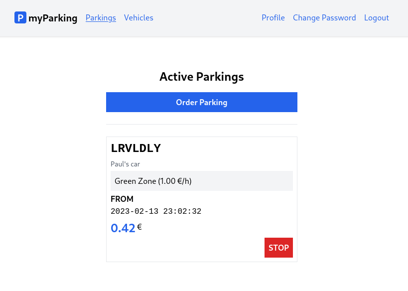

# Lesson 18 - View the active parking list and stop parking

In this lesson, we will display an active parking list with a stop button to end parking.



```jsx
import { useState, useEffect } from 'react'

import { Link } from 'react-router-dom'
import { route } from '@/routes'

function ActiveParkings() {
  const [parkings, setParkings] = useState([])

  useEffect(() => {
    const controller = new AbortController()
    getActiveParkings({ signal: controller.signal })
    return () => controller.abort()
  }, [])

  async function getActiveParkings({ signal } = {}) {
    return axios.get('parkings', { signal })
      .then(response => setParkings(response.data.data))
      .catch(() => {})
  }

  async function stopParking(parking) {
    await axios.put(`parkings/${parking.id}`)
    await getActiveParkings()
  }

  return (
    <div className="flex flex-col mx-auto md:w-96 w-full">

      <h1 className="heading">Active Parkings</h1>

      <Link to={ route('parkings.create') } className="btn btn-primary">
        Order Parking
      </Link>

      <div className="border-t h-[1px] my-6"></div>

      <div className="flex flex-col gap-1">
        { parkings.length > 0 && parkings.map((parking) => {
          return <div
            key={ parking.id }
            className="flex flex-col p-2 border gap-1"
          >
            <div className="plate text-2xl">
              { parking.vehicle.plate_number }
            </div>
            <div className="text-sm text-gray-600">
              { parking.vehicle.description }
            </div>
            <div className="bg-gray-100 p-2">
              { parking.zone.name }{' '}
              ({ (parking.zone.price_per_hour / 100).toFixed(2) } &euro;/h)
            </div>
            <div>
              <div className="font-bold uppercase">from</div>
              <span className="font-mono">{ parking.start_time }</span>
            </div>
            <div className="flex items-top">
              <span className="text-2xl font-bold text-blue-600">
                { (parking.total_price / 100).toFixed(2) }
              </span>
              <span className="pt-0.5">&nbsp;&euro;</span>
            </div>
            <button
              type="button"
              className="btn btn-danger uppercase ml-auto"
              onClick={ () => stopParking(parking) }
            >
              stop
            </button>
          </div>
        })}
      </div>
    </div>
  )
}

export default ActiveParkings
```

The `getActiveParkings()` function will retrieve the list of currently active parkings and update `parkings` state. The `useEffect` hook will call `getActiveParkings()` when component is mounted.

```jsx
const [parkings, setParkings] = useState([])

useEffect(() => {
  const controller = new AbortController()
  getActiveParkings({ signal: controller.signal })
  return () => controller.abort()
}, [])

async function getActiveParkings({ signal } = {}) {
  return axios.get('parkings', { signal })
    .then(response => setParkings(response.data.data))
    .catch(() => {})
}
```

After `setParkings(response.data.data)` call `parkings` state will have the following structure returned from API.

```json
[
    {
        "id": 3,
        "zone": {
            "name": "Red Zone",
            "price_per_hour": 300
        },
        "vehicle": {
            "plate_number": "lrvldly",
            "description": "Paul's car"
        },
        "start_time": "2023-02-01 12:58:46",
        "stop_time": null,
        "total_price": 795
    }
]
```

Since `zone.price_per_hour` and `total_price` are retrieved as cents we can format the data in the same fashion we did in the previous lesson. `zone.price_per_hour` and `total_price` is formatted using the `toFixed()` method after division.

```jsx
{ (parking.zone.price_per_hour / 100).toFixed(2) }
{ (parking.total_price / 100).toFixed(2) }
```

The `stopParking()` function will take a `parking` parameter, allowing it to determine which active parking should be stopped when the stop button is pressed. After the data is fetched, the list of active parkings will be re-rendered.

```jsx
<button
  type="button"
  className="btn btn-danger uppercase ml-auto"
  onClick={ () => stopParking(parking) }
>
  stop
</button>
```
