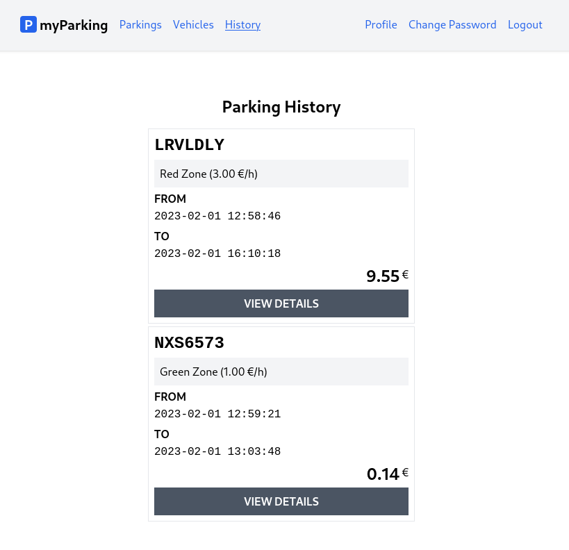

# Lesson 19 - Parking history page

Now when a parking is stopped, it simply disappears from the active parking list. The intention was to separate parking orders into "active" and "history" categories for convenience and clarity.

In this lesson, let's implement the list of parking history.



1. Create a new component `src/views/parkings/ParkingHistory.jsx`.

```jsx
import { useState, useEffect } from 'react'

function ParkingHistory() {
  const [parkings, setParkings] = useState([])

  useEffect(() => {
    const controller = new AbortController()
    getParkingHistory({ signal: controller.signal })
    return () => controller.abort()
  }, [])

  async function getParkingHistory({ signal } = {}) {
    return axios.get('parkings/history', { signal })
      .then(response => setParkings(response.data.data))
      .catch(() => {})
  }

  return (
    <div className="flex flex-col mx-auto md:w-96 w-full">

      <h1 className="heading">Parking History</h1>

      <div className="flex flex-col gap-1">
        { parkings.length > 0 && parkings.map((parking) => {
          return <div
            key={ parking.id }
            className="flex flex-col p-2 border gap-1"
          >
            <div className="plate text-2xl">
              { parking.vehicle.plate_number }
            </div>
            <div className="bg-gray-100 p-2">
              { parking.zone.name }{' '}
              ({ (parking.zone.price_per_hour / 100).toFixed(2) } &euro;/h)
            </div>
            <div>
              <div className="font-bold uppercase">from</div>
              <span className="font-mono">{ parking.start_time }</span>
            </div>
            <div>
              <div className="font-bold uppercase">to</div>
              <span className="font-mono">{ parking.stop_time }</span>
            </div>
            <div className="flex items-top">
              <span className="text-2xl font-bold ml-auto">
                { (parking.total_price / 100).toFixed(2) }
              </span>
              <span className="pt-0.5">&nbsp;&euro;</span>
            </div>
            <button
              type="button"
              className="btn btn-secondary uppercase"
            >
              view details
            </button>
          </div>
        })}
      </div>
    </div>
  )
}

export default ParkingHistory
```

The `ParkingHistory` component is very similar to what we did in the previous lesson when we implemented the active parking list. The `getParkingHistory` function operates in the same way and retrieves data from a different endpoint.

In this lesson, we have added a "view details" button, but it does not yet have an assigned `onClick` handler. This will be implemented in the next lesson.

2. Add new named route `parkings.history` to named routes in `src/routes/index.jsx` file.

Full content of this file now should look like this.

```jsx
const routeNames = {
  'home': '/',
  'register': '/register',
  'login': '/login',
  'profile.edit': '/profile',
  'profile.change-password': '/profile/change-password',
  'vehicles.index': '/vehicles',
  'vehicles.create': '/vehicles/create',
  'vehicles.edit': '/vehicles/:id/edit',
  'parkings.active': '/parkings/active',
  'parkings.history': '/parkings/history',
  'parkings.create': '/parkings/new',
}

function route(name, params = {}) {
  let url = routeNames[name]

  for (let prop in params) {
    if (Object.prototype.hasOwnProperty.call(params, prop)) {
      url = url.replace(`:${prop}`, params[prop])
    }
  }

  return url
}

export { route }
```

3. Import component and map route in `src/main.jsx` file.

```jsx
import ParkingHistory from '@/views/parkings/ParkingHistory'
```

```jsx
<Route path={ route('parkings.history') } element={<ParkingHistory />} />
```

Whole file has the following content.

```jsx
import React from 'react'
import ReactDOM from 'react-dom/client'
import { BrowserRouter, Routes, Route } from 'react-router-dom'
import axios from 'axios'
import App from '@/App'
import Home from '@/views/Home'
import Register from '@/views/auth/Register'
import Login from '@/views/auth/Login'
import EditProfile from '@/views/profile/EditProfile'
import ChangePassword from '@/views/profile/ChangePassword'
import VehiclesList from '@/views/vehicles/VehiclesList'
import CreateVehicle from '@/views/vehicles/CreateVehicle'
import EditVehicle from '@/views/vehicles/EditVehicle'
import ActiveParkings from '@/views/parkings/ActiveParkings'
import ParkingHistory from '@/views/parkings/ParkingHistory'
import OrderParking from '@/views/parkings/OrderParking'
import '@/assets/main.css'
import { route } from '@/routes'

window.axios = axios
window.axios.defaults.headers.common['X-Requested-With'] = 'XMLHttpRequest'
window.axios.defaults.withCredentials = true
window.axios.defaults.baseURL = 'http://parkingapi.test/api/v1'

ReactDOM.createRoot(document.getElementById('root')).render(
  <React.StrictMode>
    <BrowserRouter>
      <Routes>
        <Route path={ route('home') } element={<App />}>
          <Route index element={<Home />} />
          <Route path={ route('register') } element={<Register />} />
          <Route path={ route('login') } element={<Login />} />
          <Route path={ route('profile.edit') } element={<EditProfile />} />
          <Route path={ route('profile.change-password') } element={<ChangePassword />} />
          <Route path={ route('vehicles.index') } element={<VehiclesList />} />
          <Route path={ route('vehicles.create') } element={<CreateVehicle />} />
          <Route path={ route('vehicles.edit') } element={<EditVehicle />} />
          <Route path={ route('parkings.active') } element={<ActiveParkings />} />
          <Route path={ route('parkings.history') } element={<ParkingHistory />} />
          <Route path={ route('parkings.create') } element={<OrderParking />} />
        </Route>
      </Routes>
    </BrowserRouter>
  </React.StrictMode>,
)
```

4. And insert a new link to `parkings.history` route in `leftAuthLinks` function on `src/App.jsx` file.

```jsx
<NamedLink name="parkings.history">
  History
</NamedLink>
```

Now the file should have this content.

```jsx
import { Outlet } from 'react-router-dom'
import NamedLink from '@/components/NamedLink'
import { useAuth } from '@/hooks/useAuth'

function App() {
  const { isLoggedIn, logout } = useAuth()

  axios.interceptors.response.use(
    response => response,
    error => {
      if (error.response?.status === 401) logout(true)
      return Promise.reject(error)
    },
  )

  function leftGuestLinks() {
    return <>
      <NamedLink name="home">
        Home
      </NamedLink>
    </>
  }

  function leftAuthLinks() {
    return <>
      <NamedLink name="parkings.active">
        Parkings
      </NamedLink>
      <NamedLink name="vehicles.index">
        Vehicles
      </NamedLink>
      <NamedLink name="parkings.history">
        History
      </NamedLink>
    </>
  }

  function rightGuestLinks() {
    return <>
      <NamedLink name="login">
        Login
      </NamedLink>
      <NamedLink name="register">
        Register
      </NamedLink>
    </>
  }

  function rightAuthLinks() {
    return <>
      <NamedLink name="profile.edit">
        Profile
      </NamedLink>
      <NamedLink name="profile.change-password">
        Change Password
      </NamedLink>
      <button onClick={ logout } type="button" className="text-blue-600">
        Logout
      </button>
    </>
  }

  return (
    <div className="App">
      <header className="py-6 bg-gray-100 shadow">
        <div className="container md:px-2 px-4 mx-auto">
          <nav className="flex gap-4 justify-between">
            <div className="flex gap-4 items-center">
              <h2 className="text-xl font-bold">
                <div
                  className="inline-flex items-center justify-center bg-blue-600 w-6 h-6 text-center text-white rounded mr-1"
                >
                  P
                </div>
                myParking
              </h2>
              { isLoggedIn ? leftAuthLinks() : leftGuestLinks() }
            </div>
            <div className="flex gap-4 items-center">
              { isLoggedIn ? rightAuthLinks() : rightGuestLinks() }
            </div>
          </nav>
        </div>
      </header>
      <div className="container md:px-2 px-4 pt-8 md:pt-16 mx-auto">
        <Outlet />
      </div>
    </div>
  )
}

export default App
```