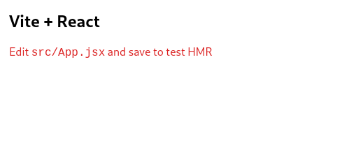

# Lesson 2 - Project setup

Now we have a default app with basic counter implementation with sample code to see how state works in React. We don't need this basic scaffolding for our application and in addition we're going to use TailwindCSS to style application.

1. Remove unnecessary files

This is the list of files we won't need in our project, you can delete them since we are not going to use them.

```
deleted:    src/App.css
deleted:    src/assets/react.svg
deleted:    src/index.css
```


2. Install TailwindCSS

Installing TailwindCSS as a PostCSS plugin is the most seamless way to integrate it with build tools like Vite.

Install `tailwindcss` and its peer dependencies via npm.

```shell
npm install -D tailwindcss postcss autoprefixer
```

After installation run this command to publish initial TailwindCSS configuration.

```
npx tailwindcss init
```

New `tailwind.config.cjs` file will be created in project root directory.

Now update this file to:

```js
const colors = require('tailwindcss/colors')

/** @type {import('tailwindcss').Config} */
module.exports = {
  content: ['./src/**/*.jsx'],
  theme: {
    extend: { colors },
  },
  plugins: [],
}
```

Following changes were applied:

- extended configuration to include more colors, so any setting will work out of the box to play around.
- and added `'./src/**/*.jsx'` value to the content key so TailwindCSS will look at all React's `jsx` files in the `./src` folder for classes to compile.

> More information how to configure TailwindCSS can be found in [official documentation](https://tailwindcss.com/docs/configuration).

Now manually create new `postcss.config.cjs` configuration file in project root directory with the following content.

```js
module.exports = {
  plugins: {
    tailwindcss: {},
    autoprefixer: {},
  },
}
```

Create new `src/assets/main.css` file with our predefined css classes we are going to use for this demo project. Tailwind's `@apply` directive extracts repeated utility patterns to custom css classes, so instead of defining them every time on each element we basically "group" them.

```
@tailwind base;
@tailwind components;
@tailwind utilities;

@layer components {
    label.required {
        @apply before:text-red-600 before:content-['*'] before:mr-1;
    }

    .form-input {
        @apply p-1 border bg-gray-100 disabled:opacity-50;
    }

    .heading {
        @apply font-bold text-2xl mb-4 text-center;
    }

    .btn {
        @apply inline-flex items-center gap-2 justify-center p-2 font-bold relative disabled:!opacity-50 disabled:!cursor-progress;
    }

    .btn-primary {
        @apply text-white bg-blue-600 hover:bg-blue-500;
    }

    .btn-secondary {
        @apply text-white bg-gray-600 hover:bg-gray-500;
    }

    .btn-danger {
        @apply text-white bg-red-600 hover:bg-red-500;
    }

    .alert {
        @apply border px-4 py-3 rounded relative;
    }

    .alert-danger {
        @apply text-red-700 bg-red-100 border-red-400;
    }

    .alert-success {
        @apply text-green-700 bg-green-100 border-green-400
    }

    .plate {
        @apply font-mono font-bold uppercase;
    }
}
```

3. Update Vite config `vite.config.js` with the following content.

```js
import { defineConfig } from 'vite'
import react from '@vitejs/plugin-react'
import { fileURLToPath, URL } from 'node:url'

// https://vitejs.dev/config/
export default defineConfig({
  plugins: [react()],
  resolve: {
    alias: {
      '@': fileURLToPath(new URL('./src', import.meta.url)),
    },
  },
})
```

Here we imported `fileURLToPath` function from node and defined `resolve.alias` for our components so we can use `@` alias to define global paths when importing components instead of relative ones. This makes life easier if you later decide to move some component to different folder.

4. After removing files not needed and Vite configuration update we also need to update existing project files to get rid of any dead references and test if our TailwindCSS works.

Update `src/App.jsx` file with the following content.

```jsx
function App() {
  return (
    <div className="p-4">
      <h1 className="heading">Vite + React</h1>
      <div className="text-red-600">
        <p>
          Edit <code>src/App.jsx</code> and save to test HMR
        </p>
      </div>
    </div>
  )
}

export default App
```

And update `src/main.jsx` file.

```jsx
import React from 'react'
import ReactDOM from 'react-dom/client'
import App from '@/App'
import '@/assets/main.css'

ReactDOM.createRoot(document.getElementById('root')).render(
  <React.StrictMode>
    <App />
  </React.StrictMode>,
)
```

Now after restarting Vite and reloading page you should see this page with some simple styling.



5. In this last step we are going to configure `eslint` as our linter for this project.

> ℹ️ This step is optional, you can skip it and successfuly complete all course material without it.

ESLint is a tool for identifying and reporting on patterns found in ECMAScript/JavaScript code, with the goal of making code more consistent and avoiding bugs.
   
This is especially useful if you are planning to work in team. There's a high chance that there will be some sort of tool to enforce specific code style and patterns.

Install eslint with react plugins to allow linter better understand the code with the following command.

```shell
npm install -D eslint eslint-plugin-jsx-a11y eslint-plugin-react eslint-plugin-react-hooks
```

Create new file `.eslintrc.cjs` in project root directory.

```js
/* eslint-env node */
module.exports = {
  root: true,
  env: {
    browser: true,
    es2021: true,
  },
  extends: [
    'eslint:recommended',
    'plugin:react/recommended',
    'plugin:react/jsx-runtime',
    'plugin:jsx-a11y/recommended',
  ],
  overrides: [],
  parserOptions: {
    ecmaVersion: 'latest',
    sourceType: 'module',
    ecmaFeatures: {
      jsx: true,
    },
  },
  plugins: ['react', 'react-hooks', 'jsx-a11y'],
  rules: {
    'no-undef': 'off',
    'comma-dangle': ['error', 'always-multiline'],
    indent: ['error', 2],
    'linebreak-style': ['error', 'unix'],
    quotes: ['error', 'single'],
    semi: ['error', 'never'],
    'react/react-in-jsx-scope': 'off',
    'react-hooks/rules-of-hooks': 'error',
    'react-hooks/exhaustive-deps': 'warn',
  },
  settings: {
    react: {
      version: 'detect',
    },
  },
}
```

Modern editors can detect eslint presence in your project and will highlight important places automatically, but you can also do that manually from command line.

To do that manually you need to update `scripts` section in your `package.json` file

from:

```json
"scripts": {
  "dev": "vite",
  "build": "vite build",
  "preview": "vite preview"
},
```

to:

```json
"scripts": {
  "dev": "vite",
  "build": "vite build",
  "preview": "vite preview",
  "lint": "eslint . --ext .js,.jsx,.cjs,.mjs --fix --ignore-path .gitignore"
},
```

To lint your project now you can run this command.

```shell
npm run lint
```