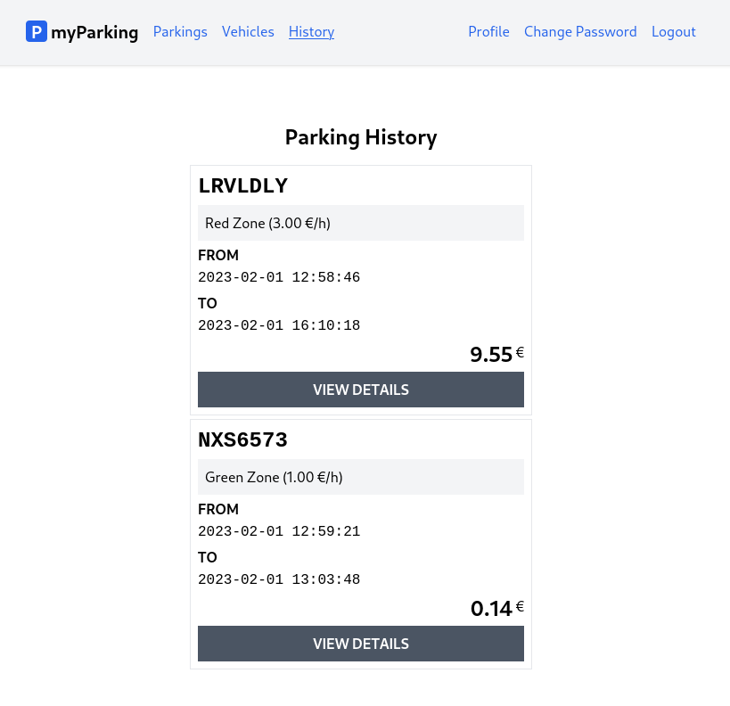

# Lesson 20 - View the parking details page

On the parking history page, we intentionally excluded some of the information about past parkings that have been archived and included a "view details" button instead.

In this lesson, we will create a parking details page to provide a comprehensive overview of all the information regarding past orders.



1. Create a new `src/views/parkings/ParkingDetails.jsx` component.

```jsx
import { useState, useEffect } from 'react'
import { useParams, Link } from 'react-router-dom'
import { route } from '@/routes'

function ParkingDetails() {
  const { id } = useParams()
  const [parking, setParking] = useState(null)

  useEffect(() => {
    const controller = new AbortController()
    getParking(id, { signal: controller.signal })
    return () => controller.abort()
  }, [id])

  async function getParking(id, { signal } = {}) {
    return axios.get(`parkings/${id}`, { signal })
      .then(response => setParking(response.data.data))
      .catch(() => {})
  }

  return (parking &&
    <div className="flex flex-col mx-auto md:w-96 w-full">

      <h1 className="heading">Parking order details</h1>

      <div className="border p-2 font-mono">
        <div className="font-bold uppercase mb-4">
          parking order #{ parking.id }
        </div>

        <div className="font-bold uppercase">license plate</div>
        <div className="plate text-2xl">
          { parking.vehicle.plate_number }
        </div>

        <div className="font-bold uppercase">description</div>
        <div>{ parking.vehicle.description }</div>

        <div className="font-bold uppercase">zone</div>
        <div>{ parking.zone.name }</div>

        <div className="font-bold uppercase">price</div>
        <div>
          { (parking.zone.price_per_hour / 100).toFixed(2) }{' '}
          &euro; per hour
        </div>

        <div className="font-bold uppercase">from</div>
        <div>{ parking.start_time }</div>

        <div className="font-bold uppercase">to</div>
        <div>{ parking.stop_time }</div>

        <div className="font-bold uppercase">total</div>
        <div className="text-xl">
          { (parking.total_price / 100).toFixed(2) } &euro;
        </div>
      </div>

      <div className="border-t h-[1px] my-6"></div>

      <Link
        to={ route('parkings.history') }
        className="btn btn-secondary uppercase"
      >
        return
      </Link>
    </div>
  )
}

export default ParkingDetails
```

To get route `:id` parameter passed to this component via URL we need to import `useParams` hook first. Then we can unpack `id` value with this line to use later.

```jsx
const { id } = useParams()
```

The `getParking()` function will retrieve the particular parking order record and update `parking` state variable. The `useEffect` hook will call `getParking()` when component is mounted by passing `id` route parameter.

```jsx
useEffect(() => {
  const controller = new AbortController()
  getParking(id, { signal: controller.signal })
  return () => controller.abort()
}, [id])

async function getParking(id, { signal } = {}) {
  return axios.get(`parkings/${id}`, { signal })
    .then(response => setParking(response.data.data))
    .catch(() => {})
}
```

When initializing `parking` state we have set its default value to null.

```jsx
const [parking, setParking] = useState(null)
```

While there's no data retrieved yet when component is mounted we want to hide the whole card. This can be done by using AND `&&` operator. Empty object doesn't satisfy this condition because it always evaluates as true.

```jsx
return (parking &&
  <div className="flex flex-col mx-auto md:w-96 w-full">
    {/* ... */}
  </div>
)
```


2. Update `src/routes/index.jsx` by adding `parkings.show` named route. Full content if this file now should look like this.

```jsx
const routeNames = {
  'home': '/',
  'register': '/register',
  'login': '/login',
  'profile.edit': '/profile',
  'profile.change-password': '/profile/change-password',
  'vehicles.index': '/vehicles',
  'vehicles.create': '/vehicles/create',
  'vehicles.edit': '/vehicles/:id/edit',
  'parkings.active': '/parkings/active',
  'parkings.history': '/parkings/history',
  'parkings.create': '/parkings/new',
  'parkings.show': '/parkings/:id',
}

function route(name, params = {}) {
  let url = routeNames[name]

  for (let prop in params) {
    if (Object.prototype.hasOwnProperty.call(params, prop)) {
      url = url.replace(`:${prop}`, params[prop])
    }
  }

  return url
}

export { route }
```

3. Import newly created component and define route for that component in `src/main.jsx` file.

```jsx
import ParkingDetails from '@/views/parkings/ParkingDetails'
```

```jsx
<Route path={ route('parkings.show') } element={<ParkingDetails />} />
```

Now it should look like this:

```jsx
import React from 'react'
import ReactDOM from 'react-dom/client'
import { BrowserRouter, Routes, Route } from 'react-router-dom'
import axios from 'axios'
import App from '@/App'
import Home from '@/views/Home'
import Register from '@/views/auth/Register'
import Login from '@/views/auth/Login'
import EditProfile from '@/views/profile/EditProfile'
import ChangePassword from '@/views/profile/ChangePassword'
import VehiclesList from '@/views/vehicles/VehiclesList'
import CreateVehicle from '@/views/vehicles/CreateVehicle'
import EditVehicle from '@/views/vehicles/EditVehicle'
import ActiveParkings from '@/views/parkings/ActiveParkings'
import ParkingHistory from '@/views/parkings/ParkingHistory'
import OrderParking from '@/views/parkings/OrderParking'
import ParkingDetails from '@/views/parkings/ParkingDetails'
import '@/assets/main.css'
import { route } from '@/routes'

window.axios = axios
window.axios.defaults.headers.common['X-Requested-With'] = 'XMLHttpRequest'
window.axios.defaults.withCredentials = true
window.axios.defaults.baseURL = 'http://parkingapi.test/api/v1'

ReactDOM.createRoot(document.getElementById('root')).render(
  <React.StrictMode>
    <BrowserRouter>
      <Routes>
        <Route path={ route('home') } element={<App />}>
          <Route index element={<Home />} />
          <Route path={ route('register') } element={<Register />} />
          <Route path={ route('login') } element={<Login />} />
          <Route path={ route('profile.edit') } element={<EditProfile />} />
          <Route path={ route('profile.change-password') } element={<ChangePassword />} />
          <Route path={ route('vehicles.index') } element={<VehiclesList />} />
          <Route path={ route('vehicles.create') } element={<CreateVehicle />} />
          <Route path={ route('vehicles.edit') } element={<EditVehicle />} />
          <Route path={ route('parkings.active') } element={<ActiveParkings />} />
          <Route path={ route('parkings.history') } element={<ParkingHistory />} />
          <Route path={ route('parkings.create') } element={<OrderParking />} />
          <Route path={ route('parkings.show') } element={<ParkingDetails />} />
        </Route>
      </Routes>
    </BrowserRouter>
  </React.StrictMode>,
)
```

4. And finally update `src/views/parkings/ParkingHistory.jsx` component.

Import `Link` and `route`.

```jsx
import { Link } from 'react-router-dom'
import { route } from '@/routes'
```

Replace the "view details" button

```jsx
<button
  type="button"
  className="btn btn-secondary uppercase"
>
  view details
</button>
```

With

```jsx
<Link
  to={ route('parkings.show', { id: parking.id }) }
  className="btn btn-secondary uppercase"
>
  view details
</Link>
```

The `src/views/parkings/ParkingHistory.jsx` file now should have the content as follows.

```jsx
import { useState, useEffect } from 'react'
import { Link } from 'react-router-dom'
import { route } from '@/routes'

function ParkingHistory() {
  const [parkings, setParkings] = useState([])

  useEffect(() => {
    const controller = new AbortController()
    getParkingHistory({ signal: controller.signal })
    return () => controller.abort()
  }, [])

  async function getParkingHistory({ signal } = {}) {
    return axios.get('parkings/history', { signal })
      .then(response => setParkings(response.data.data))
      .catch(() => {})
  }

  return (
    <div className="flex flex-col mx-auto md:w-96 w-full">

      <h1 className="heading">Parking History</h1>

      <div className="flex flex-col gap-1">
        { parkings.length > 0 && parkings.map((parking) => {
          return <div
            key={ parking.id }
            className="flex flex-col p-2 border gap-1"
          >
            <div className="plate text-2xl">
              { parking.vehicle.plate_number }
            </div>
            <div className="bg-gray-100 p-2">
              { parking.zone.name }{' '}
              ({ (parking.zone.price_per_hour / 100).toFixed(2) } &euro;/h)
            </div>
            <div>
              <div className="font-bold uppercase">from</div>
              <span className="font-mono">{ parking.start_time }</span>
            </div>
            <div>
              <div className="font-bold uppercase">to</div>
              <span className="font-mono">{ parking.stop_time }</span>
            </div>
            <div className="flex items-top">
              <span className="text-2xl font-bold ml-auto">
                { (parking.total_price / 100).toFixed(2) }
              </span>
              <span className="pt-0.5">&nbsp;&euro;</span>
            </div>
            <Link
              to={ route('parkings.show', { id: parking.id }) }
              className="btn btn-secondary uppercase"
            >
              view details
            </Link>
          </div>
        })}
      </div>
    </div>
  )
}

export default ParkingHistory
```
