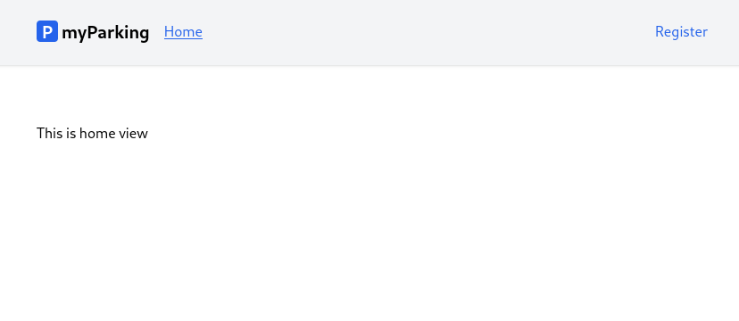
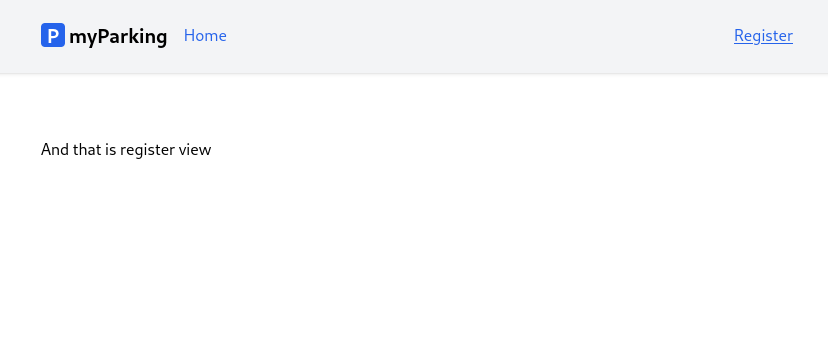

# Lesson 3 - React routing

In this lesson let's set up react router to be able to navigate between views.





1. By default react doesn't have included router so we need to install it manually with this command.

```shell
npm install react-router-dom --save
```

2. After successful installation let's prepare our first components we are going to navigate between. Create new file `src/views/Home.jsx` with the following content.

```jsx
function Home() {
  return <div>This is home view</div>
}

export default Home
```

3. And new  `src/views/auth/Register.jsx` component.

```jsx
function Register() {
  return <div>And that is register view</div>
}

export default Register
```

4. Update `src/main.jsx` file to this.

```jsx
import React from 'react'
import ReactDOM from 'react-dom/client'
import { BrowserRouter, Routes, Route } from 'react-router-dom'
import App from '@/App'
import Home from '@/views/Home'
import Register from '@/views/auth/Register'
import '@/assets/main.css'

ReactDOM.createRoot(document.getElementById('root')).render(
  <React.StrictMode>
    <BrowserRouter>
      <Routes>
        <Route path="/" element={<App />}>
          <Route index element={<Home />} />
          <Route path="register" element={<Register />} />
        </Route>
      </Routes>
    </BrowserRouter>
  </React.StrictMode>,
)
```

Here we import `BrowserRouter`, `Routes` and `Route` components from `react-router-dom`.

Whole app is wrapped in `<BrowserRoute>`. It stores the current location in the browser's address bar using clean URLs and navigates using the browser's built-in history stack.

`<Routes>` will match a set of child routes from the current location. Whenever the location changes, `<Routes>` looks through all its child routes to find the best match and renders that branch of the UI. `<Route>` elements may be nested to indicate nested UI, which also correspond to nested URL paths. Parent routes render their child routes by rendering an `<Outlet>`.

5. Update `src/App.jsx` file.

```jsx
import { Outlet, NavLink } from 'react-router-dom'

function App() {
  return (
    <div className="App">
      <header className="py-6 bg-gray-100 shadow">
        <div className="container md:px-2 px-4 mx-auto">
          <nav className="flex gap-4 justify-between">
            <div className="flex gap-4 items-center">
              <h2 className="text-xl font-bold">
                <div
                  className="inline-flex items-center justify-center bg-blue-600 w-6 h-6 text-center text-white rounded mr-1"
                >
                  P
                </div>
                myParking
              </h2>
              <NavLink end to="/" className={ ({isActive}) => {
                return isActive ? 'text-blue-600 underline' : 'text-blue-600'
              } }>Home</NavLink>
            </div>
            <div className="flex gap-4 items-center">
              <NavLink end to="/register" className={ ({isActive}) => {
                return isActive ? 'text-blue-600 underline' : 'text-blue-600'
              } }>Register</NavLink>
            </div>
          </nav>
        </div>
      </header>
      <div className="container md:px-2 px-4 pt-8 md:pt-16 mx-auto">
        <Outlet />
      </div>
    </div>
  )
}

export default App
```

In place where `<Outlet />` is defined will be rendered our `<Home>` and `<Register>` component when route defined matches them.

A `<NavLink>` is a special kind of React's regular `<Link>` that knows whether or not it is "active". This is useful when building a navigation menu where you'd like to show which of them is currently selected. It also provides useful context for assistive technology like screen readers. You can pass a function to either `style` or `className` that will allow you to customize the inline styling or the class string based on the component's active state. You can also pass a function as children to customize the content of the `<NavLink>` component based on their active state, specially useful to change styles on internal elements.

It looks like this.

```jsx
<NavLink end to="/" className={ ({isActive}) => {
  return isActive ? 'text-blue-600 underline' : 'text-blue-600'
} }>Home</NavLink>
```

If the `end` prop is used like in our case, it will ensure this component isn't matched as "active" when its descendant paths are matched. For example, to render a link that is only active at the website root and not any other URLs.

Now you should have everything working and able to navigate between newly created home and register pages.

Let's move to next lesson.