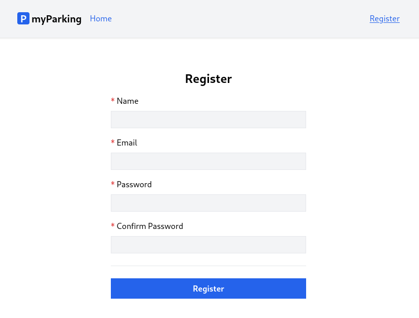

# Lesson 5 - Register page

In this lesson, we are going to update the Register page, use state and see how to handle form submit.



Update `src/views/auth/Register.jsx` with the following content.

```jsx
import { useState } from 'react'

function Register() {
  const [name, setName] = useState('')
  const [email, setEmail] = useState('')
  const [password, setPassword] = useState('')
  const [passwordConfirmation, setPasswordConfirmation] = useState('')

  function handleSubmit(event) {
    event.preventDefault()
    const data = { name, email, password, passwordConfirmation }
    console.log(data)
  }

  return (
    <form onSubmit={ handleSubmit } noValidate>
      <div className="flex flex-col mx-auto md:w-96 w-full">

        <h1 className="heading">Register</h1>

        <div className="flex flex-col gap-2 mb-4">
          <label htmlFor="name" className="required">Name</label>
          <input
            id="name"
            name="name"
            type="text"
            value={ name }
            onChange={ event => setName(event.target.value) }
            className="form-input"
            autoComplete="name"
          />
        </div>

        <div className="flex flex-col gap-2 mb-4">
          <label htmlFor="email" className="required">Email</label>
          <input
            id="email"
            name="email"
            type="email"
            value={ email }
            onChange={ event => setEmail(event.target.value) }
            className="form-input"
            autoComplete="email"
          />
        </div>

        <div className="flex flex-col gap-2 mb-4">
          <label htmlFor="password" className="required">Password</label>
          <input
            id="password"
            name="password"
            type="password"
            value={ password }
            onChange={ event => setPassword(event.target.value) }
            className="form-input"
            autoComplete="new-password"
          />
        </div>

        <div className="flex flex-col gap-2">
          <label htmlFor="password_confirmation" className="required">Confirm Password</label>
          <input
            id="password_confirmation"
            name="password_confirmation"
            type="password"
            value={ passwordConfirmation }
            onChange={ event => setPasswordConfirmation(event.target.value) }
            className="form-input"
            autoComplete="new-password"
          />
        </div>

        <div className="border-t h-[1px] my-6"></div>

        <div className="flex flex-col gap-2 mb-4">
          <button type="submit" className="btn btn-primary">
            Register
          </button>
        </div>
      </div>
    </form>
  )
}

export default Register
```

This is an ordinary form to display our registration form. There are a few things I'd like to address.

First we can see that we imported `useState` hook from React.

`useState` is React Hook that lets you add a state variable to your component. It accepts argument as an initial state value. It also can be a function.

In our case we have the following statement for our form field with an empty string as an initial value.

```jsx
const [name, setName] = useState('')
```

To display that initial value for input field we can define `value` property.

`value={ name }` set input field's value to the value of the state variable `name`. When we pass `value` property, we must also pass `onChange` handler that updates the passed value.

When we enter something in the field, value is updated using `onChange` event handler. Here we defined anonymous function which accepts that event and updates value using `setName()` function.

```jsx
<input
  id="name"
  name="name"
  type="text"
  value={ name }
  onChange={ event => setName(event.target.value) }
  className="form-input"
  autoComplete="name"
/>
```

Another not-so-important but rather convenient thing for users is `autoComplete` attributes on form fields. It defines what type of values can be auto-filled by the browser or for example password managers to generate a new password if the user uses any. More information can be found there [# HTML attribute: autocomplete](https://developer.mozilla.org/en-US/docs/Web/HTML/Attributes/autocomplete).

Exact same logic applies to all fields.

The form has `onSubmit` handler, which calls `handleSubmit()` function when we submit the form. `noValidate` property tells the browser not to attempt any field validation by default, because we will implement validation to be done by the server every time the form is submitted.

```jsx
<form onSubmit={ handleSubmit } noValidate>
```

`handleSubmit()` receives event and calls `event.preventDefault()` which means when we submit the form default HTML behavior will be prevented, otherwise, the page would just reload, so we do not want that in our case because we are going to handle submission using XHR request.

```jsx
function handleSubmit(event) {
  event.preventDefault()
  const data = { name, email, password, passwordConfirmation }
  console.log(data)
}
```

For now when you fill in form details, the data of your form can be seen in console.

That's it for this lesson, and let's move on to another one.