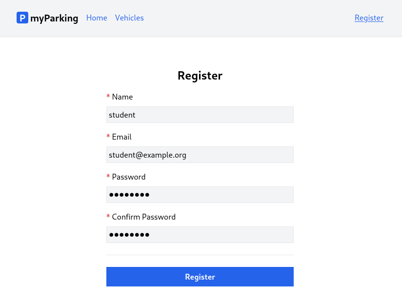

# Lesson 6 - Register implementation

In this lesson we will implement form functionality to make a request to server, and if request was successful (user was registered) redirect to vehicles list page.




1. First create a new `src/views/vehicles/VehiclesList.jsx` view for our future list. This is the page where user will be redirected after registration.

```jsx
function VehiclesList() {
  return <div>There will be vehicles list</div>
}

export default VehiclesList
```

Add a new `vehicles.index` named route to `src/routes/index.jsx` file.

```jsx
const routeNames = {
  'home': '/',
  'register': '/register',
  'vehicles.index': '/vehicles',
}
```

Define new route in `src/main.jsx` right after register route so the app can resolve `/vehicles` path to `<VehiclesList>` component.

```jsx
import VehiclesList from '@/views/vehicles/VehiclesList'
```

```jsx
<Route path={ route('register') } element={<Register />} />
<Route path={ route('vehicles.index') } element={<VehiclesList />} />
```

And add `<NamedLink>` to `vehicles.index` route in `src/App.jsx` file. File now should look like this.

```jsx
import { Outlet } from 'react-router-dom'
import NamedLink from '@/components/NamedLink'

function App() {
  return (
    <div className="App">
      <header className="py-6 bg-gray-100 shadow">
        <div className="container md:px-2 px-4 mx-auto">
          <nav className="flex gap-4 justify-between">
            <div className="flex gap-4 items-center">
              <h2 className="text-xl font-bold">
                <div
                  className="inline-flex items-center justify-center bg-blue-600 w-6 h-6 text-center text-white rounded mr-1"
                >
                  P
                </div>
                myParking
              </h2>
              <NamedLink name="home">
                Home
              </NamedLink>
              <NamedLink name="vehicles.index">
                Vehicles
              </NamedLink>
            </div>
            <div className="flex gap-4 items-center">
              <NamedLink name="register">
                Register
              </NamedLink>
            </div>
          </nav>
        </div>
      </header>
      <div className="container md:px-2 px-4 pt-8 md:pt-16 mx-auto">
        <Outlet />
      </div>
    </div>
  )
}

export default App
```

2. Now to make requests from our register form we need to install the Axios library. Run this command in your shell.

```shell
npm install axios --save
```

Then we need to import and configure Axios in `src/main.jsx` file.

```jsx
import axios from "axios";

window.axios = axios;

window.axios.defaults.headers.common["X-Requested-With"] = "XMLHttpRequest";
window.axios.defaults.withCredentials = true;
window.axios.defaults.baseURL = "http://parkingapi.test/api/v1";
```

We set `X-Requested-With` header to tell the server it is an XHR request, and it serves an additional purpose so the server must consent to CORS policies.

Option `window.axios.defaults.withCredentials = true;` tells the axios library to send the cookies along the request.

The convenience option is `window.axios.defaults.baseURL = "http://parkingapi.test/api/v1";` so we can omit full URLs in our requests and just type in the relative path of the server's API endpoint.

Now we have a setup for making requests to API. Content of `src/main.jsx` file looks like this.

```jsx
import React from 'react'
import ReactDOM from 'react-dom/client'
import { BrowserRouter, Routes, Route } from 'react-router-dom'
import axios from 'axios'
import App from '@/App'
import Home from '@/views/Home'
import Register from '@/views/auth/Register'
import VehiclesList from '@/views/vehicles/VehiclesList'
import '@/assets/main.css'
import { route } from '@/routes'

window.axios = axios
window.axios.defaults.headers.common['X-Requested-With'] = 'XMLHttpRequest'
window.axios.defaults.withCredentials = true
window.axios.defaults.baseURL = 'http://parkingapi.test/api/v1'

ReactDOM.createRoot(document.getElementById('root')).render(
  <React.StrictMode>
    <BrowserRouter>
      <Routes>
        <Route path={ route('home') } element={<App />}>
          <Route index element={<Home />} />
          <Route path={ route('register') } element={<Register />} />
          <Route path={ route('vehicles.index') } element={<VehiclesList />} />
        </Route>
      </Routes>
    </BrowserRouter>
  </React.StrictMode>,
)
```

3. React comes with several built-in Hooks like `useState`. Sometimes you'll wish that there was a Hook for some more specific purpose: for example to fetch data, hold loading state and errors. You might not find these Hooks in React, we can create our own Hooks for our application's needs.

Custom hooks let us share stateful logic, but not state itself. Components using hooks don't have as much repetitive logic. When we extract logic into custom hooks, we can hide the gnarly details of how we deal with some external system or a browser API. The of components then expresses intent and not the implementation.

Hook names must start with `use` followed by a capital letter. So let's create our first hook `useAuth` which will implement logic related to our application's auth processes.

Create new `src/hooks/useAuth.jsx` file with the following content.

```jsx
import { useNavigate } from 'react-router-dom'
import { route } from '@/routes'

export function useAuth() {
  const navigate = useNavigate()

  async function register(data) {
    return axios.post('auth/register', data)
      .then(() => {
        navigate(route('vehicles.index'))
      })
      .catch(() => {})
  }

  return { register }
}
```

Here we define `register` function to make a call to `http://parkingapi.test/api/v1/auth/register`. Remember we don't need to define full URL because we have baseURL set for Axios. If request is successful then we have another hook `useNavigate` from React Router to navigate us to `vehicles.index` route.

`useAuth()` hook returns register function, so we can use that function in our `<Register>` component.

4. Update the `src/views/auth/Register.jsx` component with the following content.

```jsx
import { useState } from 'react'
import { useAuth } from '@/hooks/useAuth'

function Register() {
  const [name, setName] = useState('')
  const [email, setEmail] = useState('')
  const [password, setPassword] = useState('')
  const [passwordConfirmation, setPasswordConfirmation] = useState('')
  const { register } = useAuth()

  async function handleSubmit(event) {
    event.preventDefault()

    await register({ name, email, password, password_confirmation: passwordConfirmation })

    setPassword('')
    setPasswordConfirmation('')
  }

  return (
    <form onSubmit={ handleSubmit } noValidate>
      <div className="flex flex-col mx-auto md:w-96 w-full">

        <h1 className="heading">Register</h1>

        <div className="flex flex-col gap-2 mb-4">
          <label htmlFor="name" className="required">Name</label>
          <input
            id="name"
            name="name"
            type="text"
            value={ name }
            onChange={ event => setName(event.target.value) }
            className="form-input"
            autoComplete="name"
          />
        </div>

        <div className="flex flex-col gap-2 mb-4">
          <label htmlFor="email" className="required">Email</label>
          <input
            id="email"
            name="email"
            type="email"
            value={ email }
            onChange={ event => setEmail(event.target.value) }
            className="form-input"
            autoComplete="email"
          />
        </div>

        <div className="flex flex-col gap-2 mb-4">
          <label htmlFor="password" className="required">Password</label>
          <input
            id="password"
            name="password"
            type="password"
            value={ password }
            onChange={ event => setPassword(event.target.value) }
            className="form-input"
            autoComplete="new-password"
          />
        </div>

        <div className="flex flex-col gap-2">
          <label htmlFor="password_confirmation" className="required">Confirm Password</label>
          <input
            id="password_confirmation"
            name="password_confirmation"
            type="password"
            value={ passwordConfirmation }
            onChange={ event => setPasswordConfirmation(event.target.value) }
            className="form-input"
            autoComplete="new-password"
          />
        </div>

        <div className="border-t h-[1px] my-6"></div>

        <div className="flex flex-col gap-2 mb-4">
          <button type="submit" className="btn btn-primary">
            Register
          </button>
        </div>
      </div>
    </form>
  )
}

export default Register
```

Here we import `useAuth` hook and `register` function.

```jsx
import { useAuth } from '@/hooks/useAuth'

// ...

const { register } = useAuth()
```

Then updated `handleSubmit()` function to call `register` function from `useAuth` hook.

```jsx
async function handleSubmit(event) {
  event.preventDefault()

  await register({ name, email, password, password_confirmation: passwordConfirmation })

  setPassword('')
  setPasswordConfirmation('')
}
```

We also added

```jsx
setPassword('')
setPasswordConfirmation('')
```

Usually when you submit the form browser would automatically clear fields with `type="password"`, but because we are preventing default behavior this won't happen by default and we need to do that manually to retain the same functionality. This code will be always executed disregarding if the request resulted in success or error which is default behavior when posting form.

After submitting the form the following response from the server will be returned:

```json
{ access_token: "118|CJv0t9yHJcPFsifkXyoMaiCJBpRyrmsXYDLENyAN" }
```

And you will be redirected to `/vehicles` URL, but we still have few things missing.

- Register form has no validation if some data is incorrect and missing
- When we register we don't save the token anywhere for protected API endpoints.

Let's finish with the form first and implement validation in the next lesson.