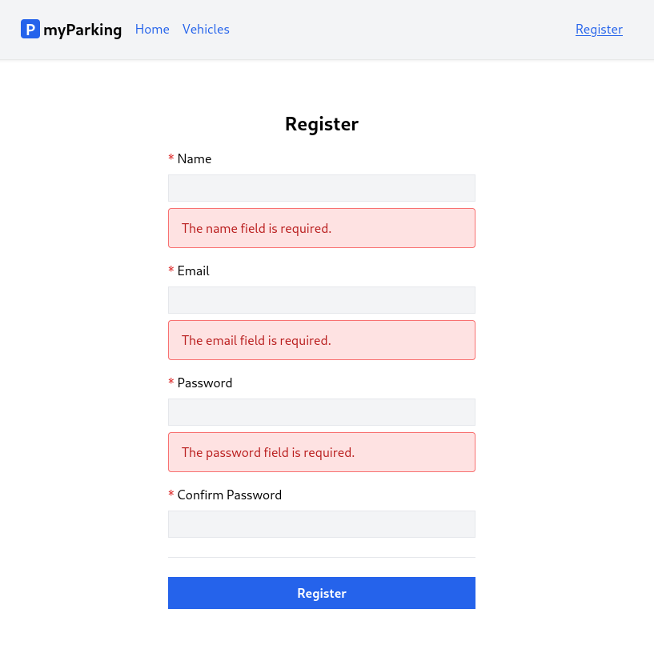

# Lesson 7 - Validation and register form

Our objective in this lesson is to display form errors on the client side.



1. When submitting forms it is crucial to indicate if the server doesn't accept the request and if some information provided needs to be clarified. In such cases, Laravel returns a response with more details. In our case, if we submit an empty form Laravel returns a response with a 422 status code with an object which looks like this:

```json
{
    "message": "The name field is required. (and 2 more errors)",
    "errors": {
        "name": [
            "The name field is required."
        ],
        "email": [
            "The email field is required."
        ],
        "password": [
            "The password field is required."
        ]
    }
}
```

Considering that we are going to have more forms in the future it is a good idea to have a component where we can pass errors object and a field name to display particular error messages under the specific field.

Now let's extend our `useAuth` hook `src/hooks/useAuth.jsx` by adding new `errors` state, this is where we are going to store the errors object returned from the backend.

`src/hooks/useAuth.jsx` file should look like this.

```jsx
import { useState } from 'react'
import { useNavigate } from 'react-router-dom'
import { route } from '@/routes'

export function useAuth() {
  const [errors, setErrors] = useState({})
  const navigate = useNavigate()

  async function register(data) {
    setErrors({})

    return axios.post('auth/register', data)
      .then(() => {
        navigate(route('vehicles.index'))
      })
      .catch(error => {
        if (error.response.status === 422) {
          setErrors(error.response.data.errors)
        }
      })
  }

  return { register, errors }
}
```

When server returns error code 422 Unprocessable entity we set errors state with the values server returned in the `catch` clause.

```jsx
setErrors(error.response.data.errors)
```

On every new submission, we want to reset `errors` state, this is done with `setErrors({})` line.

2. The hook has been set up and now it is a lot easier to implement the component to display error messages in form.

Create a new `src/components/ValidationError.jsx` component.

```jsx
import PropTypes from 'prop-types'

function ValidationError({ errors, field }) {
  return errors?.[field]?.length &&
  <div className="alert alert-danger" role="alert">
    <ul>
      { errors[field].map((error, index) => {
        return (<li key={ index }>{ error }</li>)
      }) }
    </ul>
  </div>
}

ValidationError.propTypes = {
  errors: PropTypes.object.isRequired,
  field: PropTypes.string.isRequired,
}

export default ValidationError
```

Like we did with `NamedLink` component, we define properties `errors` and `field` that component will accept and display errors for field where object key matches.

3. Now we can update our `src/views/auth/Register.jsx` component. To display error messages is pretty straightforward now.

```jsx
import { useState } from 'react'
import { useAuth } from '@/hooks/useAuth'
import ValidationError from '@/components/ValidationError'

function Register() {
  const [name, setName] = useState('')
  const [email, setEmail] = useState('')
  const [password, setPassword] = useState('')
  const [passwordConfirmation, setPasswordConfirmation] = useState('')
  const { register, errors } = useAuth()

  async function handleSubmit(event) {
    event.preventDefault()

    await register({ name, email, password, password_confirmation: passwordConfirmation })

    setPassword('')
    setPasswordConfirmation('')
  }

  return (
    <form onSubmit={ handleSubmit } noValidate>
      <div className="flex flex-col mx-auto md:w-96 w-full">

        <h1 className="heading">Register</h1>

        <div className="flex flex-col gap-2 mb-4">
          <label htmlFor="name" className="required">Name</label>
          <input
            id="name"
            name="name"
            type="text"
            value={ name }
            onChange={ event => setName(event.target.value) }
            className="form-input"
            autoComplete="name"
          />
          <ValidationError errors={ errors } field="name" />
        </div>

        <div className="flex flex-col gap-2 mb-4">
          <label htmlFor="email" className="required">Email</label>
          <input
            id="email"
            name="email"
            type="email"
            value={ email }
            onChange={ event => setEmail(event.target.value) }
            className="form-input"
            autoComplete="email"
          />
          <ValidationError errors={ errors } field="email" />
        </div>

        <div className="flex flex-col gap-2 mb-4">
          <label htmlFor="password" className="required">Password</label>
          <input
            id="password"
            name="password"
            type="password"
            value={ password }
            onChange={ event => setPassword(event.target.value) }
            className="form-input"
            autoComplete="new-password"
          />
          <ValidationError errors={ errors } field="password" />
        </div>

        <div className="flex flex-col gap-2">
          <label htmlFor="password_confirmation" className="required">Confirm Password</label>
          <input
            id="password_confirmation"
            name="password_confirmation"
            type="password"
            value={ passwordConfirmation }
            onChange={ event => setPasswordConfirmation(event.target.value) }
            className="form-input"
            autoComplete="new-password"
          />
        </div>

        <div className="border-t h-[1px] my-6"></div>

        <div className="flex flex-col gap-2 mb-4">
          <button type="submit" className="btn btn-primary">
            Register
          </button>
        </div>
      </div>
    </form>
  )
}

export default Register
```

Here we imported `ValidationError` component.

```jsx
import ValidationError from '@/components/ValidationError'
```

Unpacked errors state from useAuth hook.

```jsx
const { register, errors } = useAuth()
```

And added `ValidationError` component after each input value by passing `errors` state and field name which matches keys from API response.

```jsx
<ValidationError errors={ errors } field="name" />
<ValidationError errors={ errors } field="email" />
<ValidationError errors={ errors } field="password" />
```

> `password_confirmation` field never returns error messages, so we do not need to add it there. Password-related errors are always returned under the `password` key.

