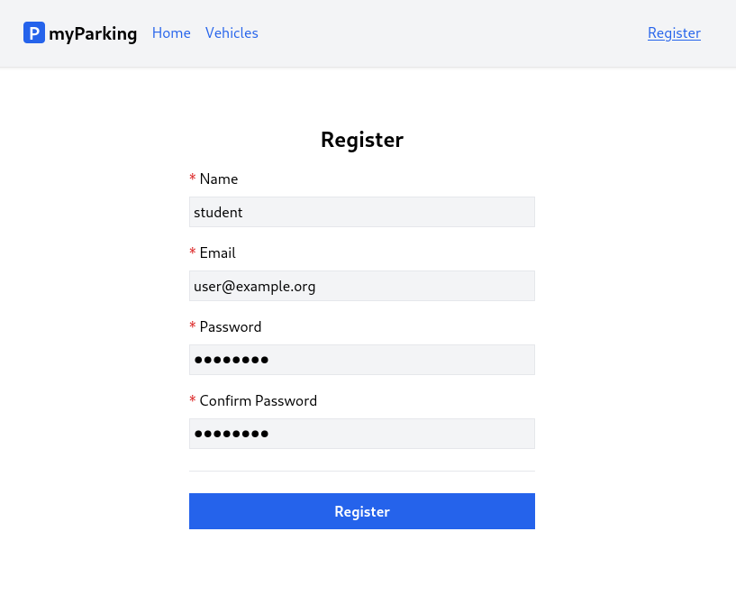
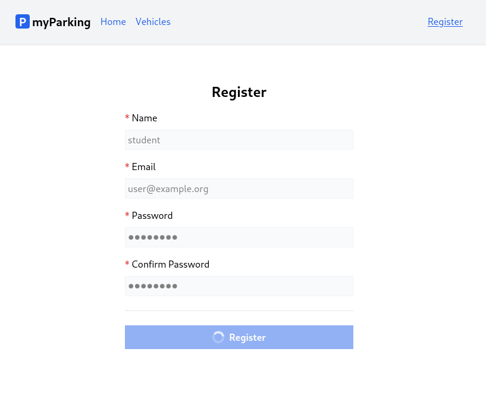

# Loading state and register form

In this lesson, when a user submits the form, we are going to indicate if the form is being processed to give the user some feedback to have a more pleasant user experience.

Before submit:



Right after the form is submitted and the client waits for a response:



1. By looking at the result we can immediately see that there is a new thing in the form, it is a loading indicator on the button.

Create a new component `src/components/IconSpinner.jsx` with the following content.

```jsx
function IconSpinner() {
  return <svg
    className="animate-spin h-5 w-5 text-white"
    xmlns="http://www.w3.org/2000/svg"
    fill="none"
    viewBox="0 0 24 24"
  >
    <circle
      className="opacity-25"
      cx="12"
      cy="12"
      r="10"
      stroke="currentColor"
      strokeWidth="4"
    ></circle>
    <path
      className="opacity-75"
      fill="currentColor"
      d="M4 12a8 8 0 018-8V0C5.373 0 0 5.373 0 12h4zm2 5.291A7.962 7.962 0 014 12H0c0 3.042 1.135 5.824 3 7.938l3-2.647z"
    ></path>
  </svg>
}

export default IconSpinner
```

This component consists of an SVG icon and some TailwindCSS classes. `animate-spin` class applies persistent rotation animation on the icon.

2. Let's update the `src/hooks/useAuth.jsx` hook by adding a loading state.

```jsx
import { useState } from 'react'
import { useNavigate } from 'react-router-dom'
import { route } from '@/routes'

export function useAuth() {
  const [errors, setErrors] = useState({})
  const [loading, setLoading] = useState(false)
  const navigate = useNavigate()

  async function register(data) {
    setErrors({})
    setLoading(true)

    return axios.post('auth/register', data)
      .then(() => {
        navigate(route('vehicles.index'))
      })
      .catch(error => {
        if (error.response.status === 422) {
          setErrors(error.response.data.errors)
        }
      })
      .finally(() => setLoading(false))
  }

  return { register, errors, loading }
}
```

At the beginning of the `register` function, we call `setLoading(true)` to update the state. In the `finally()` block we set the loading state back to false. `finally()` will be called always, even if the request failed.

And added `loading` to the return statement.

3. Now we can do the final changes to the `src/views/auth/Register.jsx` component.

Import the `IconSpinner` component.

```jsx
import IconSpinner from '@/components/IconSpinner'
```

Unpack the `loading` state from the `useAuth` hook.

```jsx
const { register, errors, loading } = useAuth()
```

Add disabled property to every input field.

```jsx
<input
  // ...
  disabled={ loading }
/>
```

The `disabled` property will be applied to input tags only if the `loading` state evaluates to true.

Also, update the button.

```jsx
<button type="submit" className="btn btn-primary" disabled={ loading }>
  { loading && <IconSpinner /> }
  Register
</button>
```

Your components will often need to display different things depending on different conditions. In our case to display `IconSpinner` only when the loading state is true, we can use AND operator `&&`. This is a common shortcut inside React components, it often comes up when you want to render some JSX when the condition is true, **or render nothing otherwise**.

Currently our `Register` component `src/views/auth/Register.jsx` should look like this.

```jsx
import { useState } from 'react'
import { useAuth } from '@/hooks/useAuth'
import ValidationError from '@/components/ValidationError'
import IconSpinner from '@/components/IconSpinner'

function Register() {
  const [name, setName] = useState('')
  const [email, setEmail] = useState('')
  const [password, setPassword] = useState('')
  const [passwordConfirmation, setPasswordConfirmation] = useState('')
  const { register, errors, loading } = useAuth()

  async function handleSubmit(event) {
    event.preventDefault()

    await register({ name, email, password, password_confirmation: passwordConfirmation })

    setPassword('')
    setPasswordConfirmation('')
  }

  return (
    <form onSubmit={ handleSubmit } noValidate>
      <div className="flex flex-col mx-auto md:w-96 w-full">

        <h1 className="heading">Register</h1>

        <div className="flex flex-col gap-2 mb-4">
          <label htmlFor="name" className="required">Name</label>
          <input
            id="name"
            name="name"
            type="text"
            value={ name }
            onChange={ event => setName(event.target.value) }
            className="form-input"
            autoComplete="name"
            disabled={ loading }
          />
          <ValidationError errors={ errors } field="name" />
        </div>

        <div className="flex flex-col gap-2 mb-4">
          <label htmlFor="email" className="required">Email</label>
          <input
            id="email"
            name="email"
            type="email"
            value={ email }
            onChange={ event => setEmail(event.target.value) }
            className="form-input"
            autoComplete="email"
            disabled={ loading }
          />
          <ValidationError errors={ errors } field="email" />
        </div>

        <div className="flex flex-col gap-2 mb-4">
          <label htmlFor="password" className="required">Password</label>
          <input
            id="password"
            name="password"
            type="password"
            value={ password }
            onChange={ event => setPassword(event.target.value) }
            className="form-input"
            autoComplete="new-password"
            disabled={ loading }
          />
          <ValidationError errors={ errors } field="password" />
        </div>

        <div className="flex flex-col gap-2">
          <label htmlFor="password_confirmation" className="required">Confirm Password</label>
          <input
            id="password_confirmation"
            name="password_confirmation"
            type="password"
            value={ passwordConfirmation }
            onChange={ event => setPasswordConfirmation(event.target.value) }
            className="form-input"
            autoComplete="new-password"
            disabled={ loading }
          />
        </div>

        <div className="border-t h-[1px] my-6"></div>

        <div className="flex flex-col gap-2 mb-4">
          <button type="submit" className="btn btn-primary" disabled={ loading }>
            { loading && <IconSpinner /> }
            Register
          </button>
        </div>
      </div>
    </form>
  )
}

export default Register
```

## Q: I submit the registration form but can't see the loading state, what to do?

## A:

This is normal especially if you work in the local environment, there are several options to trigger the loading state, the easiest ones are:

1. You can just change the `const [loading, setLoading] = useState(false)` default value from `false` to `true` and refresh the page. Your form immediately will be in a loading state.
2. To imitate network latency you can add `sleep(3)` at the beginning of your API `RegisterController` to delay the response for 3 seconds. Only if you're working locally and do not forget to remove it.

Congratulations, now you know how to implement the most commonly used practices using forms.

Let's dive into authentication scaffolding.
