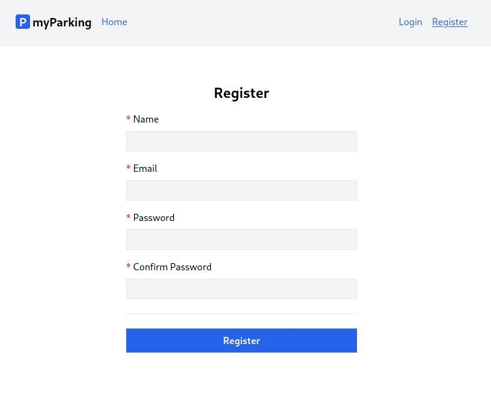

# Lesson 9 - Authentication

In this lesson, we will focus on implementing authentication, which is a crucial aspect for our client. Our objectives are as follows:

-   Upon successful registration, the client will save the token to the local storage.
-   When the logout button is pressed while the user is logged in, the access token will be removed, and the user will be redirected to the login template. We will implement the login page itself in the next lesson.
-   The navigation links will be displayed or hidden based on the user's login status.
-   If a request fails with a 401 Unauthenticated response, the user will be redirected to the login page.




1. Create a new dummy component `src/views/auth/Login.jsx`.

```jsx
function Login() {
  return <div>There will be login form</div>
}

export default Login
```

2. Declare the named route to the login page in `src/routes/index.jsx`. We chose to put it after the `register` route.

```jsx
const routeNames = {
  'home': '/',
  'register': '/register',
  'login': '/login',
  'vehicles.index': '/vehicles',
}
```

All content of `src/routes/index.jsx` looks like that.

```jsx
const routeNames = {
  'home': '/',
  'register': '/register',
  'login': '/login',
  'vehicles.index': '/vehicles',
}

function route(name, params = {}) {
  let url = routeNames[name]

  for (let prop in params) {
    if (Object.prototype.hasOwnProperty.call(params, prop)) {
      url = url.replace(`:${prop}`, params[prop])
    }
  }

  return url
}

export { route }
```

3. Import the login component and define the route in the `src/main.jsx` file.

```jsx
import Login from '@/views/auth/Login'
```

```jsx
<Route path={ route('login') } element={<Login />} />
```

`src/main.jsx` has the following content.

```jsx
import React from 'react'
import ReactDOM from 'react-dom/client'
import { BrowserRouter, Routes, Route } from 'react-router-dom'
import axios from 'axios'
import App from '@/App'
import Home from '@/views/Home'
import Register from '@/views/auth/Register'
import Login from '@/views/auth/Login'
import VehiclesList from '@/views/vehicles/VehiclesList'
import '@/assets/main.css'
import { route } from '@/routes'

window.axios = axios
window.axios.defaults.headers.common['X-Requested-With'] = 'XMLHttpRequest'
window.axios.defaults.withCredentials = true
window.axios.defaults.baseURL = 'http://parkingapi.test/api/v1'

ReactDOM.createRoot(document.getElementById('root')).render(
  <React.StrictMode>
    <BrowserRouter>
      <Routes>
        <Route path={ route('home') } element={<App />}>
          <Route index element={<Home />} />
          <Route path={ route('register') } element={<Register />} />
          <Route path={ route('login') } element={<Login />} />
          <Route path={ route('vehicles.index') } element={<VehiclesList />} />
        </Route>
      </Routes>
    </BrowserRouter>
  </React.StrictMode>,
)
```

4. To work with `localStorage` we are going to need the `react-use-storage` package to store the token in the client application.

Enter the following command in your shell.

```shell
npm install react-use-storage --save
```

5. Update the `src/hooks/useAuth.jsx` hook with the following content.

```jsx
import { useState, useMemo, useEffect } from 'react'
import { useNavigate } from 'react-router-dom'
import { useLocalStorage } from 'react-use-storage'
import { route } from '@/routes'

export function useAuth() {
  const [errors, setErrors] = useState({})
  const [loading, setLoading] = useState(false)
  const [accessToken, setAccessToken, removeAccessToken] = useLocalStorage('access_token', '')

  const navigate = useNavigate()

  const isLoggedIn = useMemo(() => !!accessToken, [accessToken])

  useEffect(() => {
    if (accessToken) {
      axios.defaults.headers.common['Authorization'] = `Bearer ${accessToken}`
    }
  }, [accessToken])

  async function register(data) {
    setErrors({})
    setLoading(true)

    return axios.post('auth/register', data)
      .then((response) => {
        setAccessToken(response.data.access_token)
        navigate(route('vehicles.index'))
      })
      .catch(error => {
        if (error.response.status === 422) {
          setErrors(error.response.data.errors)
        }
      })
      .finally(() => setLoading(false))
  }

  async function logout(force = false) {
    if (!force) {
      await axios.post('auth/logout')
    }

    removeAccessToken()
    navigate(route('login'))
  }

  return { register, errors, loading, isLoggedIn, logout }
}
```

Now we will go through what is new in this hook.

### Local Storage

We imported the `useLocalStorage` hook from the `react-use-storage` package.

```jsx
import { useLocalStorage } from 'react-use-storage'
```

Then we can define a new state variable `accessToken` and two more methods to manage that state, `setAccessToken` along with `removeAccessToken`. This is different from `useState` because it is persistent in the browser's `localStorage`, and the value is kept even if you close the browser tab.

```jsx
const [accessToken, setAccessToken, removeAccessToken] = useLocalStorage('access_token', '')
```

In the `register()` function we save the access token from the response to `localStorage` by calling `setAccessToken()`.

```jsx
.then((response) => {
  setAccessToken(response.data.access_token)
  navigate(route('vehicles.index'))
})
```

### Side effects and Authorization header update

When the token is stored, we have a side effect, which means we want to update the `Authorization` header for axios so our requests now can call protected API routes. This is done with an imported `useEffect()` hook from `react`.

```jsx
useEffect(() => {
  if (accessToken) {
    axios.defaults.headers.common['Authorization'] = `Bearer ${accessToken}`
  }
}, [accessToken])
```

`useEffect` is a React Hook that lets you synchronize a component with an external system when you need to "step out" of your React code. This includes browser APIs, third-party widgets, networks, and so on.

It accepts two parameters `useEffect(setup, dependencies?)`.

- `setup`: The function with your Effect’s logic. Your setup function may also optionally return a _cleanup_ function. When your component is first added to the DOM, React will run your setup function. After every re-render with changed dependencies, React will first run the cleanup function (if you provided it) with the old values, and then run your setup function with the new values. After your component is removed from the DOM, React will run your cleanup function one last time.
- **optional** `dependencies`: The list of all reactive values referenced inside of the `setup` code. Reactive values include props, state, and all the variables and functions declared directly inside your component body. If your linter is [configured for React](https://beta.reactjs.org/learn/editor-setup#linting), it will verify that every reactive value is correctly specified as a dependency. The list of dependencies must have a constant number of items and be written inline like `[dep1, dep2, dep3]`. React will compare each dependency with its previous value using the [`Object.is`](https://developer.mozilla.org/en-US/docs/Web/JavaScript/Reference/Global_Objects/Object/is) comparison algorithm. If you don’t specify the dependencies at all, your Effect will re-run after every re-render of the component. [See the difference between passing an array of dependencies, an empty array, and no dependencies at all](https://beta.reactjs.org/reference/react/useEffect#examples-dependencies).

```jsx
useEffect(() => {
  // This runs after every render
});

useEffect(() => {
  // This runs only on mount (when the component appears)
}, []);

useEffect(() => {
  // This runs on mount *and also* if either a or b have changed since the last render
}, [a, b]);
```

> More information and examples can be found in official React documentation:
> - [useEffect](https://beta.reactjs.org/reference/react/useEffect)
> - [Synchronizing with Effects](https://beta.reactjs.org/learn/synchronizing-with-effects)
> - [You Might Not Need an Effect](https://beta.reactjs.org/learn/you-might-not-need-an-effect)

So we have declared `accessToken` as our dependency, and if it evaluates to true, Axios `Authorization` header will be updated for future requests.

### Auth status and memoization

To display and hide navigation links we need to know if a user is logged in. We decide that depending if the token present evaluates to true.

```jsx
const isLoggedIn = useMemo(() => !!accessToken, [accessToken])
```

For this purpose, we use the `useMemo` hook, which lets us cache the result of the calculation. The value returned by the anonymous function passed to `useMemo` is memoized and React returns the same value between rerenders if dependencies declared in the array as a second argument have not changed. It will be updated only if the token value changes.

> More information on useMemo can be found here:
> - [useMemo](https://beta.reactjs.org/reference/react/useMemo)

The last function declared is `logout`. A request to delete the current token in use from the server will be sent. Then the token is removed from the client itself, and the user is redirected to the login page.

```jsx
async function logout(force = false) {
  if (!force) {
    await axios.post('auth/logout')
  }

  removeAccessToken()
  navigate(route('login'))
}
```

If Axios request fails with 401 Unauthenticated error, we call this function with force flag, which means the token is already invalid and we do not need to send that request, otherwise, we will be caught in an infinite loop.

Finally, `isLoggedIn` and `logout` are added to the return statement.

```jsx
return { register, errors, loading, isLoggedIn, logout }
```

6. Update the `src/App.jsx` component with the following content.

```jsx
import { Outlet } from 'react-router-dom'
import NamedLink from '@/components/NamedLink'
import { useAuth } from '@/hooks/useAuth'

function App() {
  const { isLoggedIn, logout } = useAuth()

  axios.interceptors.response.use(
    response => response,
    error => {
      if (error.response?.status === 401) logout(true)
      return Promise.reject(error)
    },
  )

  function leftGuestLinks() {
    return <>
      <NamedLink name="home">
        Home
      </NamedLink>
    </>
  }

  function leftAuthLinks() {
    return <>
      <NamedLink name="vehicles.index">
        Vehicles
      </NamedLink>
    </>
  }

  function rightGuestLinks() {
    return <>
      <NamedLink name="login">
        Login
      </NamedLink>
      <NamedLink name="register">
        Register
      </NamedLink>
    </>
  }

  function rightAuthLinks() {
    return <>
      <button onClick={ logout } type="button" className="text-blue-600">
        Logout
      </button>
    </>
  }

  return (
    <div className="App">
      <header className="py-6 bg-gray-100 shadow">
        <div className="container md:px-2 px-4 mx-auto">
          <nav className="flex gap-4 justify-between">
            <div className="flex gap-4 items-center">
              <h2 className="text-xl font-bold">
                <div
                  className="inline-flex items-center justify-center bg-blue-600 w-6 h-6 text-center text-white rounded mr-1"
                >
                  P
                </div>
                myParking
              </h2>
              { isLoggedIn ? leftAuthLinks() : leftGuestLinks() }
            </div>
            <div className="flex gap-4 items-center">
              { isLoggedIn ? rightAuthLinks() : rightGuestLinks() }
            </div>
          </nav>
        </div>
      </header>
      <div className="container md:px-2 px-4 pt-8 md:pt-16 mx-auto">
        <Outlet />
      </div>
    </div>
  )
}

export default App
```

Here we import `useAuth` in our main `src/App.jsx` app layout to be able to display/hide menu items and logout.

```jsx
import { useAuth } from '@/hooks/useAuth'

// ...

const { isLoggedIn, logout } = useAuth()
```

### Axios interceptor

To intercept every response received by the Axios library we need to define an interceptor. If the request was unauthenticated it will call the `logout` function. The access token will be destroyed and the user will see a login page.

```jsx
axios.interceptors.response.use(
  response => response,
  error => {
    if (error.response?.status === 401) logout(true)
    return Promise.reject(error)
  },
)
```

### Display/hide links

In JSX we can use conditional rendering using ternary operators `? :`. To make code more readable we have put navigation links into separate render functions.

```jsx
{ isLoggedIn ? leftAuthLinks() : leftGuestLinks() }
// ...
{ isLoggedIn ? rightAuthLinks() : rightGuestLinks() }
```

In our case, one of the functions looks like this.

```jsx
function rightGuestLinks() {
  return <>
    <NamedLink name="login">
      Login
    </NamedLink>
    <NamedLink name="register">
      Register
    </NamedLink>
  </>
}
```

The return statement of a component must always consist of a single element. Due to this limitation, whenever multiple elements need to be returned from a component, a wrapper element must be created. This is where React Fragment comes in. You can see them as empty tags `<>` `</>`.

With React Fragments, the extra wrapper element that was previously required to render multiple elements from a component can be eliminated. This allows multiple elements to be returned without being contained in a wrapper element.

### Logout button

In the `rightAuthLinks` function, we have a button with an `onClick` handler to call the logout function.

```jsx
function rightAuthLinks() {
  return <>
    <button onClick={ logout } type="button" className="text-blue-600">
      Logout
    </button>
  </>
}
```

Now you have implemented Authentication on your app.